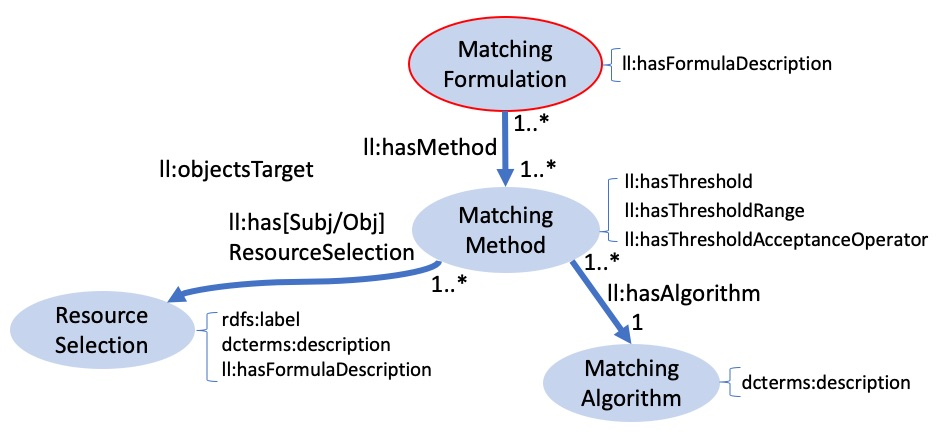

## 3. ONTOLOGY


This section presents an Ontology meant for describing in detail processes of generation and validation of links, so that decisions made such as resource selections and matching options are made explicit. Those processes are implemented in the Lenticular Lens tool and result in the creation of **Linksets** or **Lenses** according to a specification. 
The proposed ontology reuses (part of) the VoID vocabulary, as depicted in Fig 2.1 highlighting in yellow the use of VoID terms and in blue the new terminology. The VoID vocabulary provides means to describe datasets and linksets, but not the details of how they were generated, nor it provides means to describe Lenses or Validations. Moreover, their concept of linkset is not quite the same as ours. Those issues are further discussed in this section.


In the attempt to describe the proposed ontology, we dissect Fig 2.1 into four parts. First, a `Resource Selection` is elucidated. Second, we go about describing a `Matching Formulation` and show how it connects with a `Resource Selection`. The third step highlights that the description of a `Linkset` metadata involves specifying the `Resource Selections` used at the source and target positions of an entity matching process, the `Matching Formulation`, eventual validations plus statistics and authority information. The fourth and final step focuses on the annotation of a `Lens` by describing the combination of one or more Linksets and/or Lenses. 
 <div align="center"><br> <br>Fig 2.1: The Lenticular Lens Ontology</div>
<br>


### 3.1 Resource Selection
This step concerns the **selection of the resources under scrutiny**, that can potentially end up co-referent entities across or within datasources during an entity matching process. To therefore perform a matching, one first needs not only to select datasource(s) but also restrict which resources will undergo the matching. The first way of doing so is by applying a type (class) restriction. This is mandatory in the Lenticular Lens process as matching algorithms are not fully automated. Down this line, further restrictions can be applied by forcing the value of a number of properties to lie within a certain range. A `Resource Selection` is thereby, the annotation of such process.


In the ontology excerpt depicted in Figure 2.2 we propose the entity type `Resource Selection`, which is also a `void:Dataset` that is a `void:subset` of one or more `void:Dataset(s)`. It can also have further restrictions defined as `void:classPartion` and/or `void:propertyPartition`. While a `void:classPartion` solely consists in specifying the **type of entity** under scrutiny, the `void:propertyPartition` entails a little more. It consists in specifying a **property** or **property path** and the **restriction** that the selected property should undergo for the selection of the right entities for the further down the road entity matching process. Those restriction can be combined using a `Formula Description` given by `ll:hasFormulaDescription`.
 <div align="center"><br>  Fig 2.2: Selecting a matching resource </div>


In Example 2.7, the entity `resource:ResourceSelection-2` is a `ll:ResourceSelection` (and `void:Dataset`) subset of `resource:index_op_doopregister_raw_20190830` and also a collection (partition) of entities of type `pnv:PersonName` where each entity passed the filter test of (1) name in the English language which appears without trailing dots `"%...%"@en` and (2) birthdates within the interval [1600, 1699]. Finally, `resource:ResourceSelection-2` lists all entities of type `ll:PropertyConstraint` (`resource:PropertyConstraint-PHea6802ef02f99a848859`, `resource:PropertyConstraint-PHce78383e3ff6e9dd73b6` and `resource:PropertyConstraint-PH2580641bbdd572759cb9`) and elaborates on the logic expression that binds all restrictions. For example, the property restriction described by `resource:PropertyConstraint-PHce78383e3ff6e9dd73b6` documents that, applying the function `"minimal_date"@en` over dates in the format  `"YYYY-MM-DD"@en` with the year restriction of 1600 makes sure that only persons born on 1600 onwards are admitted.

 
```
-----------------
-- Example 2.7 -- RESOURCE SELECTIONS
-----------------       

### RESOURCE 2
resource:ResourceSelection-2

	a                                        void:dataset, ll:ResourceSelection ;
	rdfs:label                               "Baptisms in the 17th Century"@en ;
	void:subset                              resource:index_op_doopregister_raw_20190830 ;
	void:classPartition                      [ void:class pnv:PersonName ] ;

	void:propertyPartition                   resource:PropertyConstraint-PHea6802ef02f99a848859 ;
	void:propertyPartition                   resource:PropertyConstraint-PHce78383e3ff6e9dd73b6 ;
	void:propertyPartition                   resource:PropertyConstraint-PH2580641bbdd572759cb9 ;

	ll:hasFormulaDescription                 """
		resource:PropertyConstraint-PHce78383e3ff6e9dd73b6 
		AND resource:PropertyConstraint-PH2580641bbdd572759cb9  
		AND  (resource:PropertyConstraint-PHea6802ef02f99a848859)"""@en .


resource:PropertyConstraint-PHea6802ef02f99a848859
	a                                        ll:PropertyConstraint ;
	void:property
		[
 			a                                        rdfs:Sequence ;
			rdf:_1                                   pnv:literalName 
 		] ;

	ll:hasFilterFunction                     "not_ilike"@en ;
	ll:hasValueFunction                      "%...%"@en .


resource:PropertyConstraint-PHce78383e3ff6e9dd73b6
	a                                        ll:PropertyConstraint ;
	void:property
		[
 			a                                        rdfs:Sequence ;
			rdf:_1                                   saa:isInRecord ;
			rdf:_2                                   saa:IndexOpDoopregisters ;
			rdf:_3                                   saa:birthDate> 
 		] ;

	ll:hasFilterFunction                     "minimal_date"@en ;
	ll:hasValueFunction                      1600 ;
	ll:hasFormatFunction                     "YYYY-MM-DD"@en .


resource:PropertyConstraint-PH2580641bbdd572759cb9
	a                                        ll:PropertyConstraint ;
	void:property
		[
 			a                                        rdfs:Sequence ;
			rdf:_1                                   saa:isInRecord ;
			rdf:_2                                   saa:IndexOpDoopregisters ;
			rdf:_3                                   saa:birthDate 
 		] ;

	ll:hasFilterFunction                     "maximum_date"@en ;
	ll:hasValueFunction                      "1699"@en ;
	ll:hasFormatFunction                     "YYYY-MM-DD"@en .


```
<br>

### 3.2 Matching Formulation
For simple matching problems, finding co-referents can be done using a single matching algorithm (matcher). However, time and again the data reality often imposes the use of a number of matchers instead. In this latter scenario, clearly reporting on how these matchers work together for detecting co-referents is essential. A `Matching Formulation` entity is a resource for just doing the aforementioned, as depicted in Figure 2.3.

Once resources of type `Resource Restriction` are created, one can go ahead and used them for specifying the restricted collections to be used in a particular `Matching Method`, which also specifies the Matching Algorithm and its parameters such as threshold, range and operrator.
In the end, all `Matching Methods` used in a matching process are documented in the `Matching Formulation` resource as well as how they bind together in a logic expression given by the predicate `ll:hasFormulaDescription`. <div align="center"><br> <br>Fig 2.3: Specifying the way in which methods are logically combined </div> <BR>


In Example 2.8, the `resource:PHb99da2ecd91ad533af65` is a `ll:MatchingFormulation` listing eight `ll:MatchingMethods` used for creating a linkset. They their logic combination is described as `ll:hasFormulaDescription`.
Among the `ll:MatchingMethods`, the `resource:TIME_DELTA-PHfdc744f6bd0ced4e283a` is the only method detailes in this example, documenting the four `ll:ResourceSelections` involved, as well as the chosen `ll:MatchingAlgorithm`, namely `resource:TIME_DELTA`, besides the threshold (20), threshold-unit ("Year"@en), threshold-operator (>=) and threshold-range  "ℕ" of the matching method.


```
-----------------
-- Example 2.8 -- LINKSET LOGIC EXPRESSION
-----------------              

               ################################################################################               
               #                           LINKSET LOGIC EXPRESSION                           #
               ################################################################################ 


resource:PHb99da2ecd91ad533af65

	a                                        ll:MatchingFormulation ;
	ll:hasMethod                             resource:TIME_DELTA-PHfdc744f6bd0ced4e283a ;
   	ll:hasMethod                             resource:Exact-PH6491d1db6855098a70be ;
   	ll:hasMethod                             resource:LL_SOUNDEX-PH0ad3ad579d7a29347753 ;
   	ll:hasMethod                             resource:BLOOTHOOFT_REDUCT-PH10433274b57dafdd1335 ;
   	ll:hasMethod                             resource:Exact-PH4d4187a08c3ba4c1cf0d ;
   	ll:hasMethod                             resource:TIME_DELTA-PHe40547b9d3b6381347b4 ;
   	ll:hasMethod                             resource:LEVENSHTEIN_APPROX-PH10f4c17bbf933cae647f ;
   	ll:hasMethod                             resource:BLOOTHOOFT_REDUCT-PH98a9575087817b951447 ;
   	
	ll:hasFormulaDescription                 """
		resource:TIME_DELTA-PHe40547b9d3b6381347b4  
		AND  resource:TIME_DELTA-PHfdc744f6bd0ced4e283a  
		AND (		
			resource:Exact-PH4d4187a08c3ba4c1cf0d  
			OR (
					resource:BLOOTHOOFT_REDUCT-PH98a9575087817b951447  
					AND resource:BLOOTHOOFT_REDUCT-PH10433274b57dafdd1335)  
					OR (				
							resource:Exact-PH6491d1db6855098a70be  
							AND  (resource:LL_SOUNDEX-PH0ad3ad579d7a29347753  
							AND  resource:LEVENSHTEIN_APPROX-PH10f4c17bbf933cae647f
						)
				)
		)"""@en .


               ################################################################################               
               #                              METHOD SIGNATURES                               #
               ################################################################################

		
### METHOD SPECIFICATIONS TIME_DELTA
resource:TIME_DELTA-PHe40547b9d3b6381347b4

	a                                        ll:MatchingMethod ;
	ll:hasAlgorithm                          resource:TIME_DELTA ;
	ll:hasThresholdRange                     "ℕ" ;

	### SOURCE PREDICATE CONFIGURATION
	ll:hasSubjResourceSelection              resource:ResourceSelection-PHbe38976fdf884b6c4a8e ;
	ll:hasSubjResourceSelection              resource:ResourceSelection-PHe8fa664d04ad00aaa697 ;

	### TARGET PREDICATE CONFIGURATION
	ll:hasObjResourceSelection               resource:ResourceSelection-PH71818c17d54a8fbec22b ;
	ll:hasObjResourceSelection               resource:ResourceSelection-PHc8a3c6e494d230b79a6b .

• • •

```
<br>

 
### 3.3 Linkset
This step documents a linkset metadata including WHAT - HOW - WHEN - WHO and other processes explaining the aboutness of links. The `Matching Formulation`  specifies **HOW** entities are matched and `Resource Selection` specifies **WHAT** to match as subject and object targets. Also some statistic on the matching results can be reported such as the number of links found, the numbers of entities linked, **WHO** created the linkset and **WHEN**. Finally, a `Validation' entity can also be specified, comprising metadata with statitics and auhtority information on the validation process. Observe that when one or more validations are provided, statistics on this matter can be included in the linkset metadata, including eventual contradictions if one validation says a link is correct while another says it is not.

As discussed earlier in this section, according to the VoID documentation, the `void:Linkset` definition expects as datasources exactly one source and one target, different from each other. This means it is more restrictive than the `ll:Linkset` here proposed, since the latter also expects a linkset to contain links within a datasource or across more than two. Therefore, we do not directly reuse that concept (and its correspoding properties void:subjects/objectsTarget). Naturally, one could still use `void:Linkset` for other purposes, but at the risk of abusing the VoID vocabulary if its instances do not really fit the required restrictions. Moreover, a `void:Linkset` (i.e. a resource representing a linkset's metadata) is also not  an instance of `ll:Linkset` since the later requires the description of the processes underlying the creation of the links, which is not the case for the first.

 <div align="center"><br> <br>Fig 2.4: Specifying the linkset's context</div>
<br>


### 3.4 Lens
<br> <span style="color: purple">  **LENS.** </span>
==Another process relevant to document is the creation of Lenses. In short, a lens is the result of a set-like operation over one or more Linkset and or Lens. Therefore, the entity `Lens` documents them as `ll:hasTarget`==

 <div align="center"><br> <br>Fig 2.5: Specifying the linkset's context</div>
<br>

