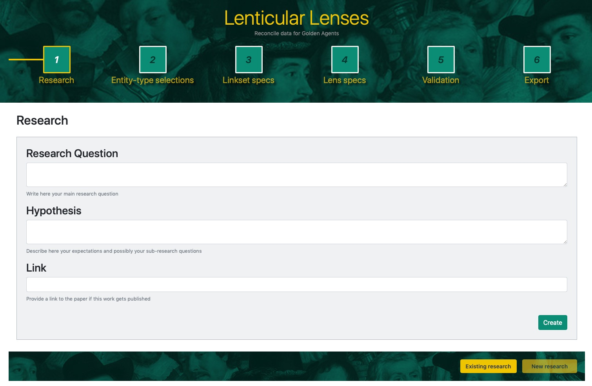
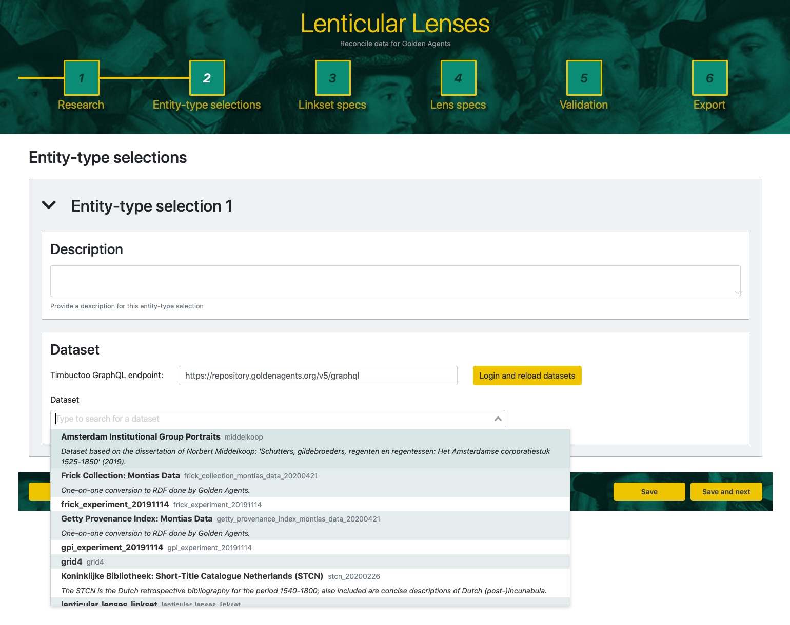
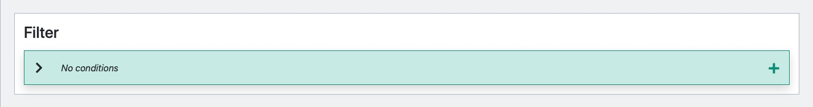
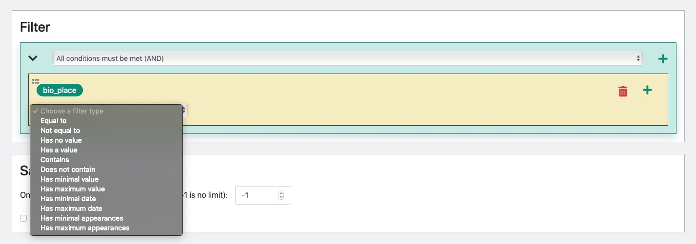
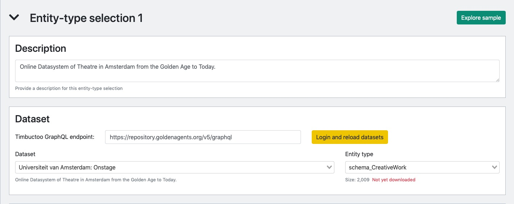
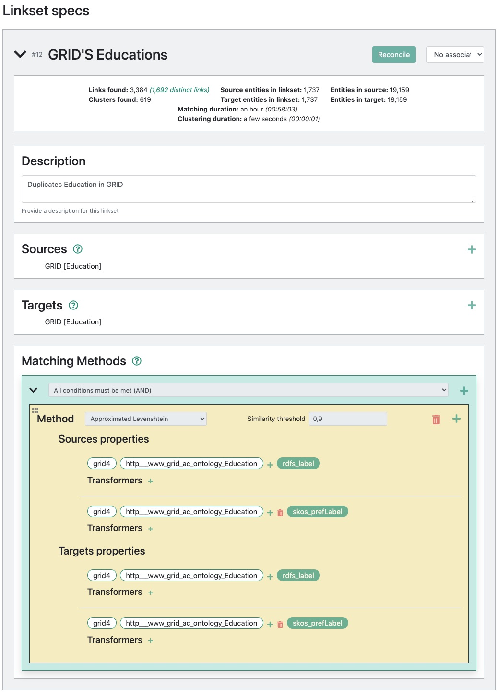
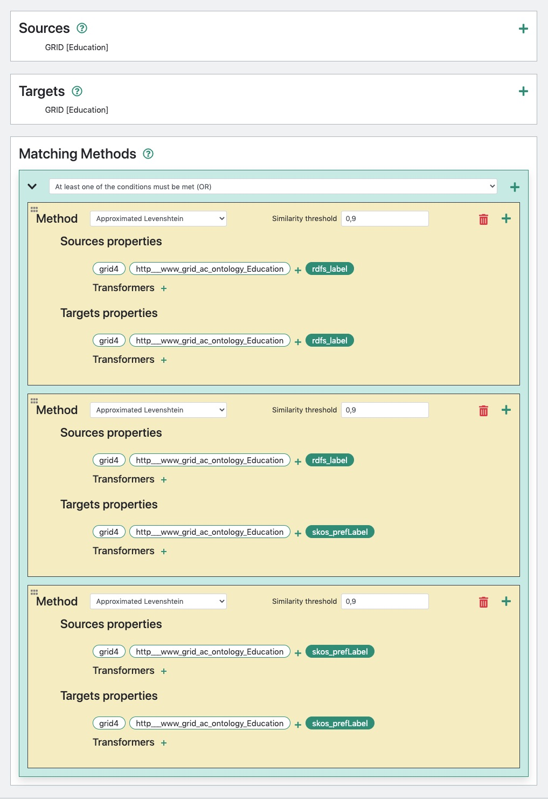
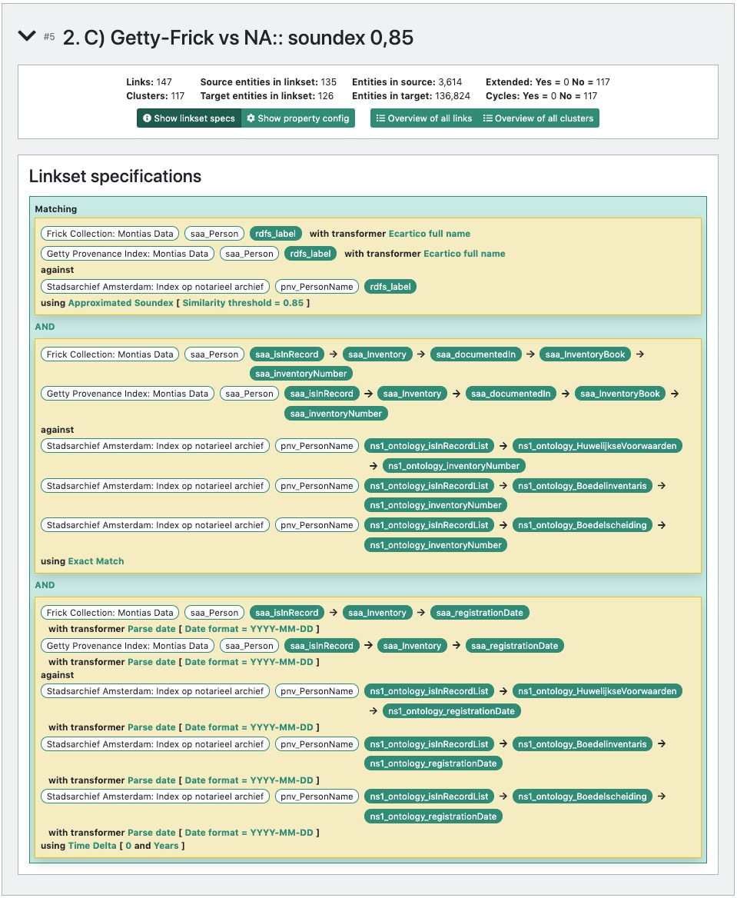

# 4. LINK CONSTRUCTION

Linking co-referent entities across a variety of datasources is a pragmatic and fast way to seamlessly navigate across datasets without having to agree in a uniform vocabulary. This solution offered in the Semantic Web architecture appears attractive as the ultimate goal for the researcher executing this task is not the integration of data but the extraction of vital information for reaching valid conclusions about problems under scrutiny. 
This said, the **Lenticular Lens** offers means to reach that ultimate goal of the researcher while making sure that the steps taken by the researcher are documented such that other researchers can easily re-generate the data leading to specific conclusions if need be.

Along the way of entity-based data integration and data extraction, the **Lenticular Lens** aims to document among others: 

  1. The datasources to integrate;
   
  2. The reasons behind a specific integration; 
  
  3. The entity types and restrictions that ensure correctness in bridging across datasources of interest; 
  
  4. The matching methods and specifications justifying the existence of a set of links. 


The **Lenticular Lens** tool aims to provide generic methods that allows a broader audience suffering the same need for data integration. The first step in creating and documenting links using the **Lenticular Lens** is defining the scope in witch links are to be created and possibly validated. For that, the tool offers the `RESEARCH` menu followed by the `SELECT` and `CONSTRUCT` menus.

We now go through each of these first three menus underlying the existence of links.


## 4.1 Scope


The `RESEARCH` menu is the starting point in learning how to interact with the **Lenticular Lens** tool. In general, a research question somehow sets the scope in which link creations, manipulations or validation take place. This provides the first building block supporting the user with defining the context in which a particular alignment is generated. Using this menu, part of the context is made explicit by selecting the datasets and entity types necessary to continue the investigation.

As an overview, the `RESEARCH` menu provides researchers with means to describe the research of interest in terms of:

* `Research Question` for inserting the main research question driving the integration. 

* `Hypothesis` for pointing out the hypothesis in mind prior to the data extraction. 

* `Link` and `Citation` to ensure that, if the results happen to be published, the researcher still has the facility to add a link to the publication and and a bibliographic reference for future reuse.

Fig. 4.1 illustrates the different fields to be filled in by the researcher for a quick overview of what can happen in this research project and why. Once providing the information is done, the `Save` button at the bottom of the page can be clicked to save the provided information and exit the **Lenticular Lens** if the user which to continue with other tasks. Or, should the user choose to continue the alternative `Save and next` button can be used to save the project and move to the next window.

 <div align="center"> Fig. 4.1:  Describing the scope of he research question. </div>
 <br>


## 4.2 Data


In the previous step or window, the researcher has defined the scope of the research for which data are to be extracted and analysed. In this second window labelled `SELECT`, the user is to describe and select the entity types involved in his research. For that, the location of the datasource needs to be provided and the datasets in which the respective entities of interest reside need to be selected.


### 4.2.1 Data Selection

As the user activates the `Saves and next` button at the end of the previous page, she is presented with a new window with a single  card labelled `Entity-Type Selection 1` as presented in Fig. 4.2.  The plus  button at the right side of the picture enables the user to create new cards when needed while the arrow-head  button at the left side of the card's label allows for the unveiling of the card as displayed in Fig 3.

 <div align="center">  Fig. 4.2:  The card view for data selection </div>
<br>

Describing the type of an entity can be done using the `Description` text box for each entity type. To provide the location of the data, the `GraphQL Endpoint` text box can be use to fill in the URL of any GraphQL end point. Once the endpoint is given and loaded, a dataset can be selected from the list of datasets available at the provided endpoint. The selection of a dataset will prompt a new dropdown text box as `Entity type`, providing the user with the facility to select the entity type of interest. After loading the provided URL of the default Golden Agent's endpoint, Fig. 4.3 shows the list of datasets available at that location to choose from.

 <div align="center">  Fig. 4.3:  List of datasets available at the default Golden Agent's GraphQL endpoint. </div> <br>
 
 
### 4.2.2 Data Restrictions


If need be to filter entities based on specific conditions, this is also possible with the `Filter` card shown in Fig. 4.6. <div align="center">  Fig. 4.6: The card for defining entity restrictions. </div> 

Once the <sub></sub> button is clicked, this card presents the user with a Filter-Logic box which enable the creation of a relatively complex and versatile entity restrictions. Fig. 4.7 for example show the list of available filtering options while Fig. 4.8 illustrates an example where the `has minimum date` and `has maximum date` filtering options are used to isolate entities of interest. These entities are now those between with a registration date between [1600, 1659] and having their respective literal name exempt of trailing dots (...).

 <div align="center">  Fig. 4.7: List of restriction options. </div> <br>


 <div align="center">  Fig. 4.8: The card for defining entity restrictions. </div> <br>


### 4.2.3 Data Exploration


At this point, successfully providing the required information (`Dataset` and `Entity-Type`) triggers the appearance of the `Explore Sample` button at the right side of the card's label (`Entity-type selection 1`) as displayed in Fig. 4.4. As illustrated in Fig. 4.5, with this button, users are now able to explore information of their choice about the entities of interest by selecting properties describing them. Keep in mind that this feature is only intended as exploration alternative to make sure of the choices (dataset, entity-type and restrictions) made.

 <div align="center">  Fig. 4.4:  Example of the `Explore sample` button showing only after the entity type is selected. </div> <br>

 <div align="center">  Fig. 4.5:  Exploring the description of entities of choice, stemmed from the dataset of interest. </div> <br>


#### 4.2.3.1 Restriction options


* <span style="color:blue"> **Equal to / Not Equal to.** </span> This option allows one to select entities that have the value of a certain property equal (or not) to a certain value. For example, all entities with property `ex:workLocation` equal (or not) to `Amsterdam`.<br>

* <span style="color:blue"> **Contains / Does not contain.** </span> This option is used to make sure that the property-value of the entities of interest **contains** or **does not contain** a specific sequence of characters. For example, `%...%` could be used for (i) excluding people whose names contain trailing dots or (ii) to select those entities to apply a particular modification onto their names, like adding the surname of the father for a baptised child whose surname is given as `...`.


* <span style="color:blue"> **Has property / Has no property.** </span> This option is used to select entities based on the existence (or not) of a certain property. Let assume, for example, that the user is interested in entities that are parents. This option allows one to filter all entities for which the a value exists for the property `ex:parentOf` for example.  It also allows you to exclude all entities that are parents if the option `Has no property ` is used instead.<br>

* <span style="color:blue"> **Has minimum / maximum value.** </span> This option allows for restricting entities to be **within** or **outside** a **specified range** given user's specified property-values of type **number** over which the restriction can be applied. To delimit both upper and lower bounds, the user can combine minimum and maximum using the logical box AND.

* <span style="color:blue"> **Has minimum / maximum date.** </span> This option allows for restricting entities to be **within** or **outside** a **specified range** given user's specified property-values of type **date** over which the restriction can be applied. Within this option, a date format can be specified. The default format is `YYYY-MM-DD`. The values 10, 300 and 1990 for example will be considered as year while 10-1, 300-1 and 1990-1 will be considered as the first month of the respective year values. To delimit both upper and lower bounds, the user can combine minimum and maximum using the logical box AND.

* <span style="color:blue"> **Has minimum / maximum appearances.** </span> This option allows for restricting entities for which a given property value occurs **within** a **specified range**. For example, to avoid excessive number of possible matches, one can delimit that only entities whose name value occur less than 5 times in the dataset will be included. To delimit both upper and lower bounds, the user can combine minimum and maximum using the logical box AND.

* <span style="color:blue"> **In set.** </span> This option allows the filtering of a collection of resources of interest based on a set of resources. These set of resources is not manually provided but can be obtained through a list of existing linksets or lenses. The example below provides a detailed understanding of this filtering approach. 


```
---------------
-- Example 1 -- IN SET
---------------
Two collections A and B to be matched via whatever method would create a se of 
links labelled linkset-AB. However, we are only interested in a subset of 
linkset-AB, such that it's resources (subject, object or both) are present in 
another given set, namely an input-linkset I. For efficiency purposes, 
linkset-AB does not need to be fully created to be filtered later on. This 
implies that the collections A and/or B need to be filtered such that 
A' = A ∩ I and/or B' = B ∩ I before executing the matching algorithm.
	
	
	######################################################
	# 		  	Linksets as named graphs	             #
	######################################################
	
	ex:input-linkset
	{
		A:Chiara  owl:sameAs	  C:Latronico .
		A:Al      owl:sameAs	  C:Al_Idrissou .
		A:Al      owl:sameAs	  C:Al_Koudous .
	}
	
	ex:linkset-AB
	{
		A:Chiara  owl:sameAs	 B:Chiara .
		A:Kerim   owl:sameAs	 B:Kerim .
	}
	
	######################################################
	# 				In Resource Set			             #
	######################################################
	### The set S of resources from input-linkset is:
	### S = {A:Chiara, A:Al, C:Latronico, C:Al_Idrissou, C:Al_Koudous}
	
	ex:linkset-SubjectInSet
	{
		A:Chiara	owl:sameAs	B:Chiara .
	}
	
```
<br>

## 4.3 Matching


So far, the `RESEARCH` and `SELECT` menus set the scene for allowing the user to create the links that will enable the integration of datasources selected within the `SELECT` menus. In the current menu, the `CREATE` menu, we will describe the built-in entity resolution algorithms for finding links between entities stemmed from the user-selected datasets. Using the **Lenticular Lens** Logic-Box, we will show how the tool makes it possible to combine the available resolution algorithms and matching rules for the discovery of links within and/or across the datasources of interest.


### 4.3.1 Algorithms 

The system offers a variety of existing algorithms from which the user can choose one or more in order to perform the matching among. These algorithms apply, for example, to strings, dates or URIs. 
Here by we describe the ones currently offered by the system and how they are meant to be used:

* Embedded
* Exact
* Intermediate
* Levenshtein
* Soundex distance
* Bloothooft
* Word Intersection
* List Intersection
* Numbers
* Time Delta
* TeAM (Text Approximation Match)

#### <span style="color: blue"> Embedded </span>
The method extracts an alignment already provided within the source dataset. The extraction relies on the value of the linking property, i.e. property of the source that holds the identifier of the target. The inconvenience in generating a linkset in such way is that the real mechanism used to create the existing alignment is not explicitly provided by the source dataset. <br>
Example 4.2 shows a sample of the grid dataset (https://www.grid.ac/downloads) with embedded links. With such links, Grid connects its instances to external datasets such as Wikidata for example using the link predicate: `grid:hasWikidataId` illustrated in Example 4.2 with the linkset `ex:Grid-embedded-linkset`.


```
---------------
-- Example 2 -- EXTRACT FROM THE GRID DATASET (https://www.grid.ac/downloads)
---------------

<http://www.grid.ac/institutes/grid.1001.0>
	foaf:homepage          <http://www.anu.edu.au/> ;
	rdfs:label             "Australian National University" ;
	grid:isni              "0000 0001 2180 7477" ;
	grid:hasWikidataId     <http://www.wikidata.org/entity/Q127990> ;
	• • •
   
<http://www.grid.ac/institutes/grid.1002.3> 
	foaf:homepage          <http://www.monash.edu/> ;
	rdfs:label             "Monash University" ;
  	grid:isni              "0000 0004 1936 7857" ;
  	grid:hasWikidataId     <http://www.wikidata.org/entity/Q598841> ;
  	• • •
  	
ex:Grid-embedded-linkset
{
	<http://www.grid.ac/institutes/grid.1001.0>   grid:hasWikidataId   <http://www.wikidata.org/entity/Q127990> .
	<http://www.grid.ac/institutes/grid.1002.3>   grid:hasWikidataId   <http://www.wikidata.org/entity/Q598841> .
}	
```
<br>


#### <span style="color: blue"> Exact </span>
This method is used to align source and target’s IRIs whenever their respective user selected property values are identical.


#### <br> <span style="color: blue"> Intermediate </span>
The method aligns the source and the target’s IRIs via an intermediate database by using properties that potentially present different descriptions of the same entity, such as country name and country code. This is possible by providing an intermediate dataset that binds the two alternative descriptions to the very same identifier.


```
---------------
-- Example 3 -- INTERMEDIATE DATASET
---------------
In the example below, it is possible to align the source and target country 
entities using the properties country and iso-3 via the intermediate dataset
because it contains the information described at both, the Source and Target.

dataset:Source-Dataset                       dataset:Intermediate-Dataset
{                                            {
	ex:1  rdfs:label  "Benin" .                 ex:7
	ex:2  rdfs:label  "Cote d'Ivoire" .              ex:name "Cote d'Ivoire" ;
	ex:3  rdfs:label  "Netherlands" .                ex:code "CIV" .
}	
                                                ex:8                             
dataset:Target-Datas                                ex:name "Benin" ;
{                                                   ex:code "BEN" .
	ex:4 ex:iso-3 "CIV" .
	ex:5 ex:iso-3 "NLD" .                       ex:9
	ex:6 ex:iso-3 "BEN" .                           ex:name "Netherlands" ;
}	                                                ex:code "NLD" .
	                                         }

ALIGNMENT: 
  • If rdfs:label is aligned with ex:name 
  • AND ex:iso-3 is aligned with ex:code,
  • We then get the following linkset:

	linkset:Match-Via-Intermediate
	{
		ex:1 owl:sameAs ex:6 .
		ex:2 owl:sameAs ex:4 .
		ex:3 owl:sameAs ex:5 .
	}

dataset:Source-Dataset                       dataset:Intermediate-Dataset
{                                            {
	ex:10  rdfs:label  "Rembrandt" .             ex:70
	ex:20  rdfs:label  "van Gogh" .                  ex:name "Vincent Willem van Gogh" ;
	ex:30  rdfs:label  "Vermeer" .                   ex:name "Vincent van Gogh" ;
}	                                                 ex:name "van Gogh" .
                                                ex:80                             
dataset:Target-Datas                                ex:name "Rembrandt" ;
{                                                   ex:name "Rembrandt van Rijn" .
	ex:40 schema:name "Rembrandt van Rijn" .
	ex:50 schema:name "Vincent van Gogh" .       ex:90
	ex:60 schema:name "Johannes Vermeer" .           ex:name "Johannes Vermeer" ;
}	                                                 ex:name "Vermeer" .
	                                         }
	
ALIGNMENT: 
  • If rdfs:label is aligned with ex:name 
  • AND schema:name is also aligned with ex:name,
  • we then get the following linkset:

	linkset:Match-Via-Intermediate
	{
		ex:10 owl:sameAs ex:40 .
		ex:20 owl:sameAs ex:50 .
		ex:30 owl:sameAs ex:60 .
	}
```


#### <br> <span style="color: blue"> Levenshtein </span>
This ​method is used to align ​​source a​nd ​​target’s IRIs whenever the similarity score of their respective user selected property values are ​​above a given ​Levenshtein Distance threshold​.

Edit distance is a way of quantifying how ​dissimilar two strings (e.g., words) are to one another by counting the minimum number of operations ​ε ​ (​removal, insertion, or substitution of a character in the string)​ required to transform one string into the other. For example, ​the ​Levenshtein distance between "kitten" and "sitting" is ​ε ​= 3 as it requires a two substitutions ("s" for "k" and "i" for "e") and one insertion of "g" at the end [https://en.wikipedia.org/wiki/Edit_distance]​.

**Normalisation ​Ω​:** Because in this application, the ​similarity score ​Ω ​of a matching pair needs to be quantified in the interval ​[0, 1]​, the​ dissimilarity score ​ε expressing the ​minimum number of operations ​between two strings ​is then normalised as ​Ω based on the length of the longest string. The ​dissimilarity score​​ ε​ = 3 ​between ​"kitten" and "sitting" is then normalised to a ​similarity score Ω​ ​=​ ​1 - 3 / 7 = 0.57​.​

**Minimum threshold ​φ:** Using this algorithm, ​a ​minimum threshold valueφ​ ​must be set in the interval ​[0,1], ​such that finding any matched pairs of IRIs based on the similarity of their respective property values depends on whether or not the computed ​Ω is ​equal or above ​φ​. A threshold ​φ = 1 equates an exact match. In our previous example, if a ​minimum threshold of ​φ = ​0.7 is set, "kitten" and "sitting" will not be matched. ​In short, ​φ is the user defined threshold when the similarity score ​Ω is selected for accepting or rejecting a match.

**Maximum character error threshold ​𝛿:​** In case the ​original edit distance score ​ε (minimum number of operations score) is preferred, the number of character errors ​𝛿 ​of choice is used instead as threshold for deciding whether a match is accepted or rejected. However, for consistency purposes, the corresponding normalisation value ​Ω is still computed for the minimum number of operations score computed ​ε​. For instance, in our previous example, if a ​maximum ​characters errors i​s set to ​𝛿 = 3, "kitten" and "sitting" will be matched but the computed strength will be ​Ω = ​0.57 a​nd ​not ​ε = 3 as is it only serves the purpose of decision maker. I​n short, ​𝛿 i​s the user defined threshold when the dissimilarity score ε​ ​is selected for accepting or rejecting a match.

```
---------------
-- Example 4 -- NORMALISATION 
---------------

	1. l_dist(Rembrand van Rijn, Rembrandt Harmensz van Rijn) = 10
	2. Normalised_l_dist ​(Rembrand van Rijn, Rembrandt Harmensz van Rijn) = 0.63
	
	>>> If ​φ (Minimum threshold) = 0.7 
	>>> t​hen ​[​Rembrand van Rijn] owl:sameAs [Rembrandt Harmensz van Rijn] 
	>>> is rejected​ 
	>>> because Ω​ = 0.63 < φ​.
	
	>>> If ​δ (Maximum character error threshold) = 5 
	>>> t​hen [​​Rembrand van Rijn] and [Rembrandt Harmensz van Rijn] is ​rejected 
	>>> because ε ​= 10 >​ ​δ.
	
```


#### <br> <span style="color: blue"> Soundex Distance </span>
“Soundex is a phonetic algorithm for indexing names by sound, as pronounced in English. The goal is for homophones to be encoded to the same representation so that they can be matched despite minor differences in spelling. The algorithm mainly encodes consonants; a vowel will not be encoded unless it is the first letter” [ https://en.wikipedia.org/wiki/Soundex]. <br>


```
---------------
-- Example 5 -- SOUNDEX CODE SIZE
---------------
The examples below shows the encoding of different names. Here, the size 
parameter indicates a degree of similarity through the length of the 
respective soundex codes. For example at  size=3, Albert and Albertine 
have the same soundex representation while at size=5 their  respective 
representations differ. In the Lenticular lens, the default size is set 
to 3.

	-----------------------------
	INPUT 	 	 SIZE 3   SIZE 5  
	-----------------------------
	A.      	 A000     A00000                                  
	AL			 A400     A40000                                 
	ALI			 A400     A40000                               
	ALBERT		 A416     A41630                                
	ALBERTINE	 A416     A41635 
```

In the **Lenticular Lens**, Soundex is used as a normaliser in the sense that an edit distance is run over the soundex code version of a name. For example, the in the table below, the normalisation of both `Louijs Rocourt ` and ``Lowis Ricourt` becomes `L200 R263` leading to an edit distance of 0 and a relative strength of 1. However, computing the same names using directly an edit distance results in an edit distance of 3 and a relative matching strength of 0.
79.


```
---------------
-- Example 6 -- THE USE OF SOUNDEX CODE FOR STRING APPROXIMATION
---------------

The example below shows the implementation of Soundex Distance 
in the Lenticular Lens and how it compares with Edit Distance
over the original names (no soundex-based normalisation).

------------------------------------------------------------------------------------------------------------------------------------------------------
Source                      Target                     E. Dist  Rel. distance  Source soundex       Target  soundex       Code E. Dist  Code Rel. Dist
------------------------------------------------------------------------------------------------------------------------------------------------------
Jasper Cornelisz. Lodder    Jaspar Cornelisz Lodder          2           0.92  J216 C654 L360       J216 C654 L360                   0             1.0
Barent Teunis               Barent Teunisz gen. Drent       12           0.52  B653 T520            B653 T520 G500 D653             10            0.47
Louijs Rocourt              Louys Rocourt                    2           0.86  L200 R263            L200 R263                        0             1.0
Louijs Rocourt              Lowis Ricourt                    3           0.79  L200 R263            L200 R263                        0             1.0
Louys Rocourt               Lowis Ricourt                    3           0.77  L200 R263            L200 R263                        0             1.0
Cornelis Dircksz. Clapmus   Cornelis Clapmuts               10            0.6  C654 D620 C415       C654 C415                        5            0.64
Geertruydt van den Breemde  Geertruijd van den Bremde        4           0.85  G636 V500 D500 B653  G636 V500 D500 B653              0             1.0
```


#### <br> <span style="color: blue"> Bloothooft </span>
This approximation method is specifically tailored for accessing the similarity between a pair of  IRIs for which the user selected property values are Dutch names. The algorithm basically normalises the given names by removing or replacing specific characters…. 
The resulting normalised names are then pairwise compared using the Approximated Levenshtein Distance (see the description of Approximated Levenshtein Distance).


```
-----------------
-- Example 4.7 --
-----------------
                              
```


#### <br> <span style="color: blue"> Word Intersection </span>
This approximation method is originally designed to find a subset of words within a larger text. However, it could also be used for any  pair of strings regardless of the strings sizes. Several options are available: 

* Whether or not the order in which the words are found is important.
* Whether or not the computed strength of each word should be approximated or identical.
* Whether or not abbreviation should be detected.
* Whether the default stopping character should be used, not used or modified.
* A threshold on the number of words not approximated/identical.
* An overall  threshold for accepting or rejecting a match.


```
-----------------
-- Example 4.8 -- EXPECTATIONS
-----------------
	For example, it can be used for aligning 
	 - [Rembrand van Rijn] and [van Rijn Rembrandt]
	 - [Herdoopers anslagh op Amsterdam] and [Herdoopers anslagh op Amsterdam. 
	    Den x. may: 1535. Treur-spel.]
	regardless of the words' order.
```


#### <br> <span style="color: blue"> List Intersection </span>
This method is better suited for matching events. It helps establishing a relationship between the source and target entities whenever a list of entities from the source dataset intersects another list of entities stemmed from the target dataset. 

For illustration, suppose that we have the two events in Example 4.9. (1) Event one, defined by the source event-entities, documents event-entities that lists entities representing persons about to get married. This event is the `Intended-Marriage` event. (2) Event two is the `Marriage` event. It lists (i) entities representing persons that got married and (ii) the guests who attended the event. <br>
Now that the two events are defined, let us imagine that we would like to find out which of the `Intended-Marriage` couple fulfilled its will to get married. For this to be true, we assume that a couple with the wish to be wed should end-up being present at a `Marriage` event, hopefully their own marriage. This means that, for a match to occur, a **minimum of two elements from a list from the source** must also belong to a list from the target. In other words, a match is to be generated whenever 100% (all) of the elements in a source's lists intersects a target's list. 

In this method, two thresholds are to be defined. The first threshold or **similarity-threshold** imposes a minimum accepted similarity score (generally in ]0, 1]) when elements stemmed from different lists are compared. Passing this threshold is interpreted as the occurrence of an intersection between elements of two lists. The second threshold, the **intersection-threshold** expressed in quantity or percentage, denotes the minimum number of intersections that must occur for a link to be created. <br>
In practice, looking at Example 4.9, only events `ex: intended-1` and `ex:married-2` are a match as the pairs (`Catharina Reminck` , `Catharina Remink`) and (`Mr. Jean de Melie`, `Jean de Melie`) are respectively similar with a score of 0.94 and 0.82.


```
---------------
-- Example 9 -- LIST INTERSECTION
---------------
	A source dataset documenting events as lists of couple with the intention of getting married and a 
	target dataset with list of people at a wedding ceremony. Each of these latter lists is expected to
	includes the wed couple.

	Similarity-threshold   : 0.8
	Intersection-threshold : 2 or 100%
	
------------------------------------------------------------------------
Source Dataset                           Target Dataset
------------------------------------------------------------------------

ex:intended-1                               ex:ceremony-1
	ex:wife     "Catharina Reminck" ;            ex:participant  "Pieter Jas" ;
	ex:husband  "Mr. Jean van de Melie" .        ex:participant  "Jacob Poppen" ;
	                                             ex:participant  "Gillis Graafland" ;
ex:intended-2                                    ex:participant  "Jacob Fransz. de Witt" ;
	ex:wife     "Eva Oostrom"  ;                 ex:participant  "Elisabeth van Daaken" ;
	ex:husband  "Pieter de Vriest" .             ex:participant  "Catharina Berewouts" ;
	                                             ex:participant  "Aafje Hendricx" ;
ex:intended-3	                                 ex:participant  "Anthony van Paembergh" ;
    ex:wife     "Eva Oostrom ;                   ex:participant  "Eva van Toorn" ;
	 ex:husband  "Wiggert van Wesick" .          ex:participant  "Maria Bor" .
	                                             
                                            ex:married-2
                                                ex:participant  "J. van de Melie" ,
                                                    "Bernardus van Vijven" .
                                                    "Margrita Schrik" ,
                                                    "Johannes de Bruijn" ,
                                                    "Maria Gosina Demol" ,
                                                    "Agneta Swartepaart",
                                                    "Hendrik de Lange" ,
                                                    "Catharina Remink" .
```


#### <br> <span style="color: blue"> Numbers </span>
The method is used to align the source and the target by approximating the match of the (number/date) values of the selected properties according to a delta. For example, if two entities have been aligned based on the similarity of their names but an extra check is to be investigated based on their respective year of birth, setting the delta to 1 will ensure that the two entities are born within the same year, give or take a year.


#### <br> <span style="color: blue"> Time Delta </span>
This function allows for finding co-referent entities on the basis of a **minimum time difference** between the times reported by the source and the target entities. For example, if the value zero is assigned to the time difference parameter, then, for a matched to be found, the time of the target and the one of the source are to be the exact same times. While accounting for margins of error, one may consider a pair of entities to be co-referent if the real entities are born lambda days, months or years apart among other-things (similar name, place..). 


Other ways of using time delta are also possible: 

<span style="color:blue">**Time Delta before / After.** </span>
Because Time Delta has no direction or sign (+ or -), it is not possible to require that the time documented at the source entity occurs before or after the one reported by the target's event. With the `before / After` options, this is possible.
 
<span style="color:blue">**Time Delta Between.** </span> In here, we make it possible for the user to define the time interval in which both the source and target reported times can be viewed as acceptable.
 

#### <br> <span style="color: blue"> TeAM </span>
The TeAM (Text Approximation Match) method allows for the approximation of the relevance of a document to a query. Such approximation can be done using lexical similarity (word level similarity), semantic similarity or hybrid similarities. In this method, the focus is rather on the lexical similarity. Although tailored to text, it has been adapted to also be applicable to name-based similarity. We now provide an overview of the motivation context supporting the design and implementation of the algorithm.

The Amsterdam's city archives (SAA) possesses physical handwritten inventories records where a record may be for example an inventory of goods (paintings, prints, sculpture, furniture, porcelain, etc.) owned by an Amsterdamer and mentioned in a last will. Interested in documenting the ownership of paintings from the 17th century, the Yale University Professor John Michael Montias compiled a database by transcribing 1280 physical handwritten inventories (scattered in the Netherlands) of goods. Now that a number of these physical inventories have been digitised using handwriting recognition, one of the goals of the Golden Agent project is to identify Montias' transcriptions of painting selections within the digitised inventories. This problem can be generically reformulated as, given a <span style="color:blue">*source-segment database (e.g. Montias DB)*</span> and a <span style="color:blue">*target-segment database (e.g. SAA)*</span>, *find the best similar target segment  for each source segment*. 


 <div align="center">  Fig 4.9: An example of the digitisation of inventory documents available at the Amsterdam's city archives. </div> 

<br>


### 4.3.2 Combinations 


This section addresses **Complex Methods** as ways to combine matching methods, not to be confused with the complexity of the underlying the methods. 
All of the matching methods described earlier generate links with matching strength scores in the interval ]0, 1]. 
We saw for example that the relative strength score between ​`Rembrand van Rijn` and `Rembrandt Harmensz van Rijn` is 0.63 using the Levenshtein algorithm and 0.74 using Soundex. 
Those methods can be combined at time of creation of the linkset, using logic boxes, or afterwards, using lenses operators.

When such combination happens, a decision is necessary regarding the calculation of the resulting strength score.
For example, let us assume that links are created whenever a pair of datasets items (subject, object) either **sounds alike** or **looks alike character-wise**. 
To accomplish that, it means that two methods have to be combined, for example, Soundex and Levenshtein. 
Although combining the methods seems relatively easy, deciding on the matching score requires some extra thoughts. 
In the example above of Rembrandt, shall we consider 0.63 or 0.74? Or their product?
Here we discuss the rationals used in the **Lenticular lens** to support such decision.


The two standard logic operators traditionally used are **Conjunction (AND)** and **Disjunction (OR)**. 
The first takes the minimum strength and the latter takes the maximum strength. This applies for both **classic values** (True -1- or False -0-) and **fuzzy values** ( between 0 and 1 ). 

Since the results from matching methods are **fuzzy values** in the interval ]0,1], the table bellow illustrates the default behaviour of the Lenticular Lens when combining them.


```
----------------
-- Example 10 -- STANDARD LOGIC OPERATIONS OVER CONJUNCTION (MIN) AND DISJONCTION
----------------

Source                      Target                       Levenshtein  Soundex      OR(max)    AND(min)
------------------------------------------------------------------------------------------------------
Jasper Cornelisz. Lodder    Jaspar Cornelisz Lodder             0.92     1.00        1.00         0.92
Rembrand van Rijn           Rembrandt Harmensz van Rijn         0.63     0.74        0.74         0.63
Barent Teunis               Barent Teunisz gen. Drent           0.52     0.47        0.52         0.47
```  

However, more sophisticated operations can also be used, such as the **T-norm binary operations** as alternatives for **Conjunction (AND)** and the **T-conorm binary operations** as alternatives for **Disjunction (OR)** as provided in the next subsections.


####  4.3.2.1 T-norms 

A list of six different operations can be applied when dealing with methods combined by **Conjunction**. Here, we present them:

* Minimum t-norm ⊤<sub>min</sub> (a, b) = min{a, b}

* Product t-norm ⊤<sub>prod</sub> (a, b) = a . b

* Łukasiewicz t-norm ⊤<sub>Luk</sub> (a, b) = max(0, a+b-1)

* Drastic t-norm ⊤<sub>D</sub> (a, b) = b (if a = 1) , a (if b = 1), 0 (otherwise)

* Nilpotent minimum ⊤<sub>nM</sub> (a, b) = min{a, b} (if a + b > 1), 0 (otherwise)

* Hamacher product ⊤<sub>H<sub>0</sub></sub> (a, b) = 0 (if a = b = 0), ab / (a + b - ab) (otherwise)


The following table provides three case studies to illustrate the application of each of the aforementioned **T-norm binary operations**. They are presented in order from the less strict (**⊤<sub>min</sub>**) to the most strict (**⊤<sub>D</sub>**).

|Source, Target                                                            | Levenshtein, Soundex | ⊤<sub>min</sub> | ⊤<sub>H<sub>0</sub></sub> | ⊤<sub>prod</sub> | ⊤<sub>nM</sub>  | ⊤<sub>Luk</sub> | ⊤<sub>D</sub> |
|--------------------------------------------------------------------------|:--------------------:|-----------------|---------------------------|-------------------|-----------------|-----------------|----------------|
| **Src**: Jasper Cornelisz. Lodder <br> **Trg**: Jaspar Cornelisz Lodder  |           0.92, 1.00 |     0.920       |                     0.920 |             0.920 |           0.920 |           0.920 |          0.920 |
| **Src**: Rembrand van Rijn <br> **Trg**: Rembrandt Harmensz van Rijn     |           0.63, 0.74 |     0.630       |                     0.516 |             0.466 |          0.630  |           0.370 |          0.000 |
| **Src**: Barent Teunis <br> **Trg**: Barent Teunisz gen. Drent           |           0.52, 0.47 |     0.470       |                     0.328 |             0.244 |          0.000  |           0.000 |          0.000 |


<br>
#### 4.3.2.2 T-conorms 

A list of six different operations can also be applied when dealing with methods combined by **Disjunction**. Here, we present them:

* Maximum t-conorm ⊥<sub>max</sub> (a, b) = max{a, b}

* Probabilistic sum ⊥<sub>sum</sub> (a, b) = a + b - a.b

* Bounded sum ⊥<sub>Luk</sub> (a, b) = min{a + b, 1}

* Drastic t-conorm ⊥<sub>D</sub> (a, b) = b (if a=0), a (if b=0), 1 (otherwise)

* Nilpotent maximum ⊥<sub>nM</sub> (a, b) = max(a, b) (if a + b < 1), 1 (otherwise)

* Einstein sum ⊥<sub>H<sub>2</sub></sub> (a, b) = (a + b) / (1 + ab)

|Source, Target                                                            | Levenshtein, Soundex | ⊤<sub>D</sub>   | ⊤<sub>Luk</sub>  | ⊤<sub>H<sub>2</sub></sub> | ⊤<sub>sum</sub> | ⊤<sub>nM</sub>  |   ⊤<sub>max</sub> |
|--------------------------------------------------------------------------|:--------------------:|-----------------|------------------|----------------------------|-----------------|-----------------|--------------------|
| **Src**: Jasper Cornelisz. Lodder <br> **Trg**: Jaspar Cornelisz Lodder  |           0.92, 1.00 |     1.000       |            1.000 |                      1.000 |           1.000 |           1.000 |              1.000 |
| **Src**: Rembrand van Rijn <br> **Trg**: Rembrandt Harmensz van Rijn     |           0.63, 0.74 |     1.000       |            1.000 |                      0.934 |          0.904  |           1.000 |              0.740 |
| **Src**: Barent Teunis <br> **Trg**: Barent Teunisz gen. Drent           |           0.52, 0.47 |     1.000       |            0.990 |                      0.796 |          0.746  |           0.520 |              0.520 |


#### 4.3.2.3 Examples


Suppose that, two data items E-1 and E-2 have the following information:

* E-1
	* **Name**:  Titus Rembrandtsz. van Rijn
	* **Mather**: Saskia Uylenburgh
	* **Father**: Rembrand van Rijn
	* **Parent's Marriage date**: 1644-06-22

* E-2
	* **Name**: T. Rembrandtszoon van Rijn
	* **Mather**: Saske van Uijlenburg
	* **Father**: Rembrandt Harmensz van Rijn
	* **Baptism date**:1641-09-22

To interpret E-1 and E-2 as representing co-referent persons, the following four tests are proposed. 

* **Test-1 OR** : Here, the names of E-1 and E-2 are to be compared using the **Levenshtein** and **Soundex** algorithms at a threshold of **at least 0.7**.


```
MATCHING RESULTS
 - Levenshtein(Titus Rembrandtsz van Rijn, T. Rembrandtszoon van Rijn)  => 0.73 ✓
 - sdx_1 = Soundex(Titus Rembrandtsz van Rijn) = T320 R516 V500 R250
 - sdx_2 = Soundex(T. Rembrandtszoon van Rijn) = T000 R516 V500 R250
 - Levenshtein(sdx_1, sdx_2)                                            => 0.89 ✓

DISJUNCTIONS RESULTS
 - names similarity   = t_conorm(0.73, 0.88, 'MAXIMUM')                 => 0.89 ✓
 - names similarity   = t_conorm(0.73, 0.88, 'PROBABILISTIC')           => 0.97 ✓
```


* **Test-2 AND** : Names of the postulated mothers and fathers are to be similar at a threshold of at **least 0.6** using the **Levenshtein** algorithm.

```
MATCHING RESULTS
 - Levenshtein(Saskia Uylenburgh, Saske van Uijlenburg)                 => 0.65 ✓
 - Levenshtein(Rembrand van Rijn, Rembrandt Harmensz van Rijn)          => 0.63 ✓

CONJUNCTION RESULTS
 - Parent's names similarity  = t_norm(0.65, 0.63, 'MINIMUM')           => 0.63 ✓
 - Parent's names similarity  = t_norm(0.65, 0.63, 'HAMACHER')          => 0.47 ❌
```


* **Test-3** : The period between the parent's **marriage date** on the one side and the **child's baptism** date on the other side are to be **no more than 25 years apart**.


```
MATCHING RESULTS
 - Delta(1668-02-28, 1669-03-22, 25)                                       => 1.00 ✓
```


* **Test-4 AND** : Combining all above three tests considering a the conjunction fuzzy operator should result in a similarity score above or equal to 0.8.


```
--------------------------------------------------------------------------------------
FINAL CONJUNCTIONS WITH A TRUTH VALUE LIST OF [0.850, 0.63, 1] 
--------------------------------------------------------------------------------------
  - t_norm_list([0.850, 0.63, 1], 'MINIMIUM')                           => 0.63 ❌
  - t_norm_list([0.850, 0.63, 1], 'HAMACHER')                           => 0.58 ❌
  - t_norm_list([0.850, 0.63, 1], 'PRODUCT')                            => 0.56 ❌
  - t_norm_list([0.850, 0.63, 1], 'NILPOTENT')                          => 0.63 ❌
  - t_norm_list([0.850, 0.63, 1], 'Łuk')                                => 0.52 ❌
  - t_norm_list([0.850, 0.63, 1], 'DRASTIC')                            => 0.00 ❌

--------------------------------------------------------------------------------------
CONJUNCTIONS WITH A DIFFERENT LIST OF TRUTH VALUES [0.89, 0.82, 1]
--------------------------------------------------------------------------------------
 - t_norm_list([0.89, 0.82, 1], "MINIMUM")                              => 0.82 ✓
 - t_norm_list([0.89, 0.82, 1], "HAMACHER")                             => 0.74 ❌
 - t_norm_list([0.89, 0.82, 1], "PRODUCT")                              => 0.73 ❌
 - t_norm_list([0.89, 0.82, 1], "NILPOTENYT")                           => 0.82 ✓
 - t_norm_list([0.89, 0.82, 1], "LUK")                                  => 0.71 ❌
 - t_norm_list([0.89, 0.82, 1], "DRASTIC")                              => 0.0  ❌

--------------------------------------------------------------------------------------
EXAMPLE USING MORE THAN ONE FUZZY LOGIC OPERATOR
--------------------------------------------------------------------------------------
  - Ops.t_norm(Ops.t_norm(0.850, 0.63, 'HAMACHER'), 1, 'MINIMIUM')      => 0.57 ❌
  - Ops.t_norm(Ops.t_norm(0.850, 0.63, 'MINIMIUM'), 1, 'HAMACHER')      => 0.63 ❌
```

**Conclusion**: Given the **evidence** provided for E-1 and E-2  and the **rules** described above, the interpretation resulting from the chosen fuzzy logic operations leads to the conclusion that there is no sufficient evidence to infer that the underlying data items are co-referent. This rejection is mainly due to the low similarity of the parents' names. If the resulting similarity were above 0.8, there would then be a better chance for the data items to be co-referent. Keep in mind that our conjectured rule asserts an identity relation for combination of scores only when above 0.8. A better data or more advanced algorithm could have helped.


## 4.4 Matching in Practice

Now that we have gone through available matching methods and how to combine them in the **Lenticular Lens**, we show their application in some case-studies aligning resources stemmed from various datasources of one's choice.
We also provide example on the rdf export of the resulting linksets with metadata. For this purpose we choose as syntax the turtle format and RDFStar reification.


### 4.4.1 Simple Methods

This case-study section aims to showcase **matching problems involving a SINGLE matching method** (Embedded, Exact, Intermediate, Levenshtein Distance, Soundex Distance, Gerrit Bloothooft, Word Intersection, List Intersection, Numbers and TeAM) run over one or multiple datasets.

We call them **Simple Methods** as opposed to **Complex Methods** illustrated in the sequel. Keep in mind that the terms **Simple** and **Complex** refer to the use of single or combined methods and not to the algorithm complexity of the underlying the method(s).


#### Case-1: Grid 
In this case study, displayed in Fig 4.10, the goal is to find out whether there exist duplicates Education Instances within the Grid's dataset. The dataset is composed of nine types of institutions including 27715 **Companies**, 19353 **Educations**, 12547 **Nonprofit** institutes, 12465  **Healthcare** institutes, 8499 **Facility** institutes, 5762 **Government** institutes, 2724 **Archive** institutes and 7823 institutes with no type specified. 
Although the dataset is of multiple types of entities, the case-study here aims only to deduplicate instances of type **Education**. This is depicted in Fig 4.10 where the `Sources` and `Targets` cards are `GRID[Education]` showing that the entity type `Education` has been selected within the `GRID` dataset.

Also in the `Matching Methods` card, it can be seen that on both sides (source and target) two properties are selected for checking whether duplicates exist. This check relies on whether there exist entities that are documented within the GRID dataset with similar names using `rdfs_label` and `skos_prefLabel`.
As the similarity score is measured in the interval 0 (not similar) to 1 (exactly similar), the threshold defined as 0.9 ensures that only paired entities with a high similarity (0.9 or above) are accepted.

The same card shows the selected algorithm as `Levenshtein Distance`, which is run over the selected predicates generating 1,692 distinct links as shown in the statistics card (on the top). The latter card also provides statistics on:

* The `number of entities` at the `Source` and `Target`. In this particular case, over 19K educational institutes at both source and target as they are the same dataset. Such information provides hints on the maximum number of links to expect in the worst case scenario  as well as an idea on how long the running algorithm could take.

* The `number of entities matched` at the `subject` and `object` positions.

* The `number of clusters` derived from the links found. Here, this provides a potentially better picture on the number of real entities, as co-referent are grouped together in clusters of varoius sizes.

* The `Runtime durations` informing on the elapsed time for (1) finding links and for (2) clustering them. <div align="center"><br>  Fig 4.10: An example showing how to deduplicate a dataset using edit distance with a user-defined threshold of 0.9. </div> 

In this example, we deliberately choose two properties at both the `Source` and `Target` datasets for the deduplication. Choosing for more than one property either for the `Source` or `Target` triggers a combination of pairwise property-value matching joined with the logic operator **OR**. For example choosing properties x and y at the source while choosing only z at the target triggers the following pairwise combinations: (`x AND z`) **OR** (`y AND z`). 

In the current use-case, choosing for example `rdfs_label` and `skos_prefLabel` at both `Source` AND `Target` generates the following combination: `rdfs_label AND rdfs_label` **OR** `rdfs_label AND skos_prefLabel` **OR** `skos_prefLabel AND skos_prefLabel`. 
This explicit combination is implemented as an alternative complex method in the next section, where three executions of the `Levenshtein Distance` algorithm is required, instead of one. 


#### Case-1: RDF Results
This section provides the complete metadata of the resulting Linkset for the specification above in Example 4.15, plus a sample of 9 links due to space limitation.

From this metadata, a number of general statistical information on the linkset can be obtained, such as the number of distinct `triples`, `entities` or `clusters`, the number of links `accepted` or `rejected` and more.

The metadata also presents a detailed description on the methods used to generate the links. For example, for each algorithm used, a `uri` and `description` is provided. This algorithm can be used in one or more methods, provided the link acceptance `threshold`, the `range` of the similarity score, the `datasets`, `data-types` and `predicates` uris used for link findings.

Furthermore, a specific annotation is provided in an RDFStar format for each generated link. In this example, we have the `strength` of the link and whether the link has been validated (`accepted`, `rejected` or `not_validated` ). <br>


```
----------------
-- Example 15 --
----------------

### PREDEFINED SHARED NAMESPACES ###    
    @prefix                  rdf: <http://www.w3.org/1999/02/22-rdf-syntax-ns#> .
    @prefix                 rdfs: <http://www.w3.org/2000/01/rdf-schema#> .
    @prefix                  owl: <http://www.w3.org/2002/07/owl#> .
    @prefix                 void: <http://rdfs.org/ns/void#> .
    @prefix              dcterms: <http://purl.org/dc/terms/> .
    @prefix               format: <http://www.w3.org/ns/formats/> .
    @prefix                  pav: <http://purl.org/ontology/similarity/> .
    @prefix                   cc: <http://creativecommons.org/ns#> .

### PREDEFINED SPECIFIC NAMESPACES ###
    @prefix                   ll: <http://data.goldenagents.org/ontology/> .
    @prefix              ll_algo: <http://data.goldenagents.org/ontology/matching-method/> .
    @prefix               ll_val: <http://data.goldenagents.org/ontology/validation/> .
    @prefix              linkset: <http://data.goldenagents.org/resource/linkset/> .
    @prefix              dataset: <http://data.goldenagents.org/resource/dataset/> .

### AUTOMATED NAMESPACES ###
    @prefix                 skos: <http://www.w3.org/2004/02/skos/core#> .
    @prefix        institutes_S1: <http://www.grid.ac/institutes/> .


###########################################
#            GENERIC METADATA             #
###########################################


linkset:Grid

    a                                        void:Linkset ;
    cc:attributionName                       "LenticularLens" ;
    void:feature                             format:Turtle ;
	cc:license                               <http://purl.org/NET/rdflicense/W3C1.0> ; 
	ll:has-logic-formulation                 <http://data.goldenagents.org/resource/PHbb54a8dab0d2954> ;

    void:linkPredicate                       skos:exactMatch ; 
	void:subjectsTarget                      <http://data.goldenagents.org/resource/dataset/Grid> ; 
	void:objectsTarget                       <http://data.goldenagents.org/resource/dataset/Grid> ;
    dcterms:description                      "Deduplication of entities of type Education in the GRID dataset"@en ;

    void:triples                             1692 ;
    void:entities                            1737 ;
    void:distinctSubjects                    1737 ;
    void:distinctObjects                     1737 ; 
    
	ll:has-clusters                          619 ; 
	ll_val:has-validations                   18 ; 
	ll_val:has-accepted                      3 ; 
	ll_val:has-rejected                      6 ; 
	ll_val:has-remaining                     1683 .


               #############################################             
               #            LOGIC FORMULA PARTS            #
               #############################################              


<http://data.goldenagents.org/resource/PHbb54a8dab0d2954>

	a                                       ll:LogicFormulation ;
	ll:has-method                           <http://data.goldenagents.org/resource/Normalised-EditDistance-H30d57e26e41bb04> ;

	ll:has-formula-description              """<http://data.goldenagents.org/resource/Normalised-EditDistance-H30d57e26e41bb04>
	""" .


               #############################################               
               #            METHOD SIGNATURES              #
               #############################################               


### ll_algo:Normalised-EditDistance ###
<http://data.goldenagents.org/resource/Normalised-EditDistance-H30d57e26e41bb04>

	a                                       ll:MatchingMethod ;
	ll:has-algorithm                        ll_algo:Normalised-EditDistance ;
	ll:has-threshold                        0.9 ;
	ll:has-threshold-range                  "]0, 1]" ;
	ll:has-threshold-acceptance-operator    <http://data.goldenagents.org/resource/Greater-than-or-equal-to> ;

	ll:has-subj-entity-selection            <http://data.goldenagents.org/resource/EntitySelection-PH61bd543e4ce34c2> ;
	ll:has-subj-predicate-selection         <http://data.goldenagents.org/resource/PredicateSelection-PHab504e102405ab0> ;
	ll:has-subj-predicate-selection         <http://data.goldenagents.org/resource/PredicateSelection-PH0d712649af643f3> ;

	ll:has-obj-entity-selection             <http://data.goldenagents.org/resource/EntitySelection-PH61bd543e4ce34c2> ;
	ll:has-obj-predicate-selection          <http://data.goldenagents.org/resource/PredicateSelection-PHab504e102405ab0> ;
	ll:has-obj-predicate-selection          <http://data.goldenagents.org/resource/PredicateSelection-PH0d712649af643f3> .


               #############################################               
               #            METHOD DESCRIPTIONS            #
               #############################################               


ll_algo:Normalised-EditDistance 
	a                                       ll:MatchingAlgorithm ;
	dcterms:description                      """
        This ​method is used to align ​​source a​nd ​​target’s IRIs whenever the similarity score of their respective 
        user selected property values are ​​above a given ​Levenshtein (edit) Distance threshold​. 
        Edit distance is a way of quantifying how ​dissimilar two strings (e.g., words) are to one another by 
        counting the minimum number of operations ​ε ​(​removal, insertion, or substitution of a character in the 
        string)​ required to transform one string into the other. For example, ​the ​Levenshtein distance between 
        kitten and sitting is ​ε ​= 3 as it requires a two substitutions (s for k and i for e) and one insertion  
        of g at the end [https://en.wikipedia.org/wiki/Edit_distance]​.
    """@en .


               #############################################               
               #       DATASET AND ENTITY SELECTIONS       #
               #############################################               


### ENTITY SELECTION [SOURCE] N0: 1 ###
<http://data.goldenagents.org/resource/EntitySelection-PH61bd543e4ce34c2> 
	a                                       ll:EntitySelection ;
	ll:has-dataset                          <http://data.goldenagents.org/resource/dataset/Grid> ;
	ll:has-entity-type                      <http://www.grid.ac/ontology/Education> .


               #############################################               
               #           PREDICATE SELECTIONS            #
               #############################################               


### PREDICATE SELECTED [SOURCE]  N0: 1 ###
<http://data.goldenagents.org/resource/PredicateSelection-PHab504e102405ab0> 
	a                                       ll:PropertySelection ;
	ll:has-entity-selection                 <http://data.goldenagents.org/resource/EntitySelection-PH61bd543e4ce34c2> ;
	ll:has-predicate                        <http://www.w3.org/2000/01/rdf-schema#label> .


### PREDICATE SELECTED [SOURCE]  N0: 2 ###
<http://data.goldenagents.org/resource/PredicateSelection-PH0d712649af643f3> 
	a                                       ll:PropertySelection ;
	ll:has-entity-selection                 <http://data.goldenagents.org/resource/EntitySelection-PH61bd543e4ce34c2> ;
	ll:has-predicate                        <http://www.w3.org/2004/02/skos/core#prefLabel> .


###########################################
#            ANNOTATED LINKSET            #
###########################################

linkset:Grid
{
    <<institutes_S1:grid.1017.7    skos:exactMatch    institutes_S1:grid.501980.5>>
		ll_val:has-validation               "rejected" :
		ll:has-matching-strength            0.933 .

    <<institutes_S1:grid.1019.9    skos:exactMatch    institutes_S1:grid.449929.b>>
		ll_val:has-validation               "accepted" ;
		ll:has-matching-strength            1 .

    <<institutes_S1:grid.1020.3    skos:exactMatch    institutes_S1:grid.266826.e>>
		ll_val:has-validation               "not_validated" ;
		ll:has-matching-strength            1 .

    <<institutes_S1:grid.10215.37    skos:exactMatch    institutes_S1:grid.10347.31>>
		ll_val:has-validation               "rejected" ;
		ll:has-matching-strength            0.950 .

    <<institutes_S1:grid.10215.37    skos:exactMatch    institutes_S1:grid.10595.38>>
		ll_val:has-validation               "rejected" ;
		ll:has-matching-strength            0.900 .
		

    <<institutes_S1:grid.10215.37    skos:exactMatch    institutes_S1:grid.4462.4>>
		ll_val:has-validation               "rejected" ;
		ll:has-matching-strength            0.900 .
		

    <<institutes_S1:grid.10347.31    skos:exactMatch    institutes_S1:grid.10595.38>>
		ll_val:has-validation               "rejected" ;
		ll:has-matching-strength            0.900 .

    <<institutes_S1:grid.10347.31    skos:exactMatch    institutes_S1:grid.441173.4>>
		ll_val:has-validation               "rejected" ;
		ll:has-matching-strength            0.900 .

    <<institutes_S1:grid.10347.31    skos:exactMatch    institutes_S1:grid.4462.4>>
		lll_val:has-validation              "accepted" ;
		ll:has-matching-strength            0.900 .
		
	• • •
}
		
```
<br>


### <span style="color:purple"> 4.4.2 Complex Methods  </span>


#### <span style="color:purple"> Case-1: Alternative </span>

In Fig 4.11 is displayed an alternative where  <div align="center"><br>  Fig 4.11: An example showing how to deduplicate a dataset using an edit distance with threshold 0.9. </div>
<br>


#### <span style="color:purple"> Case-1: RDF Results </span>

```
###########################################
#               NAMESPACES               #
###########################################

### PREDEFINED SHARED NAMESPACES    
    @prefix                  rdf: <http://www.w3.org/1999/02/22-rdf-syntax-ns#> .
    @prefix                 rdfs: <http://www.w3.org/2000/01/rdf-schema#> .
    @prefix                  owl: <http://www.w3.org/2002/07/owl#> .
    @prefix                 void: <http://rdfs.org/ns/void#> .
    @prefix              dcterms: <http://purl.org/dc/terms/> .
    @prefix               format: <http://www.w3.org/ns/formats/> .
    @prefix                  pav: <http://purl.org/ontology/similarity/> .
    @prefix                   cc: <http://creativecommons.org/ns#> .

### PREDEFINED SPECIFIC NAMESPACES
    @prefix                   ll: <http://data.goldenagents.org/ontology/> .
    @prefix              ll_algo: <http://data.goldenagents.org/ontology/matching-method/> .
    @prefix               ll_val: <http://data.goldenagents.org/ontology/validation/> .
    @prefix              linkset: <http://data.goldenagents.org/resource/linkset/> .
    @prefix              dataset: <http://data.goldenagents.org/resource/dataset/> .

### AUTOMATED NAMESPACES
    @prefix                 skos: <http://www.w3.org/2004/02/skos/core#> .
    @prefix        institutes_S1: <http://www.grid.ac/institutes/> .


##############################################################################################################
#                                              GENERIC METADATA                                              #
##############################################################################################################


linkset:Grid_2

    a                                        void:Linkset ;
    cc:attributionName                       "LenticularLens" ;
    void:feature                             format:Turtle ;
	cc:license                               <http://purl.org/NET/rdflicense/W3C1.0> ; 
	ll:has-logic-formulation                 <http://data.goldenagents.org/resource/PH1ec0ee6f368dd62> ;

    void:linkPredicate                       skos:exactMatch ; 
	void:subjectsTarget                      <http://data.goldenagents.org/resource/dataset/Grid> ; 
	void:objectsTarget                       <http://data.goldenagents.org/resource/dataset/Grid> ;
    dcterms:description                      "Deduplication of entities of type Education in the GRID dataset"@en ;

    void:triples                             1692 ;
    void:entities                            1737 ;
    void:distinctSubjects                    1737 ;
    void:distinctObjects                     1737 ; 
    
	ll:has-clusters                          619 ; 
	ll_val:has-validations                   18 ; 
	ll_val:has-accepted                      3 ; 
	ll_val:has-rejected                      6 ; 
	ll_val:has-remaining                     1683 .


               ################################################################################               
               #                             LOGIC FORMULA PARTS                              #
               ################################################################################               


<http://data.goldenagents.org/resource/PH1ec0ee6f368dd62>

	a                                       ll:LogicFormulation ;
	ll:has-method                           <http://data.goldenagents.org/resource/Normalised-EditDistance-H779a0ad1b5e5f93> ;
	ll:has-method                           <http://data.goldenagents.org/resource/Normalised-EditDistance-H3de4966a0b8aa01> ;
	ll:has-method                           <http://data.goldenagents.org/resource/Normalised-EditDistance-H11cbb0cc77c44a9> ;

	ll:has-formula-description              """<http://data.goldenagents.org/resource/Normalised-EditDistance-H779a0ad1b5e5f93>
	 and (⊤min) <http://data.goldenagents.org/resource/Normalised-EditDistance-H3de4966a0b8aa01>
	 and (⊤min) <http://data.goldenagents.org/resource/Normalised-EditDistance-H11cbb0cc77c44a9>
	""" .


               ################################################################################               
               #                              METHOD SIGNATURES                               #
               ################################################################################               


### ll_algo:Normalised-EditDistance
<http://data.goldenagents.org/resource/Normalised-EditDistance-H779a0ad1b5e5f93>

	a                                       ll:MatchingMethod ;
	ll:has-algorithm                        ll_algo:Normalised-EditDistance ;
	ll:has-threshold                        0.9 ;
	ll:has-threshold-range                  "]0, 1]" ;
	ll:has-threshold-acceptance-operator    <http://data.goldenagents.org/resource/Greater-than-or-equal-to> ;

	ll:has-subj-entity-selection            <http://data.goldenagents.org/resource/EntitySelection-PH61bd543e4ce34c2> ;
	ll:has-subj-predicate-selection         <http://data.goldenagents.org/resource/PredicateSelection-PHab504e102405ab0> ;

	ll:has-obj-entity-selection             <http://data.goldenagents.org/resource/EntitySelection-PH61bd543e4ce34c2> ;
	ll:has-obj-predicate-selection          <http://data.goldenagents.org/resource/PredicateSelection-PHab504e102405ab0> .


### ll_algo:Normalised-EditDistance
<http://data.goldenagents.org/resource/Normalised-EditDistance-H3de4966a0b8aa01>

	a                                       ll:MatchingMethod ;
	ll:has-algorithm                        ll_algo:Normalised-EditDistance ;
	ll:has-threshold                        0.9 ;
	ll:has-threshold-range                  "]0, 1]" ;
	ll:has-threshold-acceptance-operator    <http://data.goldenagents.org/resource/Greater-than-or-equal-to> ;

	ll:has-subj-entity-selection            <http://data.goldenagents.org/resource/EntitySelection-PH61bd543e4ce34c2> ;
	ll:has-subj-predicate-selection         <http://data.goldenagents.org/resource/PredicateSelection-PHab504e102405ab0> ;

	ll:has-obj-entity-selection             <http://data.goldenagents.org/resource/EntitySelection-PH61bd543e4ce34c2> ;
	ll:has-obj-predicate-selection          <http://data.goldenagents.org/resource/PredicateSelection-PH0d712649af643f3> .


### ll_algo:Normalised-EditDistance
<http://data.goldenagents.org/resource/Normalised-EditDistance-H11cbb0cc77c44a9>

	a                                       ll:MatchingMethod ;
	ll:has-algorithm                        ll_algo:Normalised-EditDistance ;
	ll:has-threshold                        0.9 ;
	ll:has-threshold-range                  "]0, 1]" ;
	ll:has-threshold-acceptance-operator    <http://data.goldenagents.org/resource/Greater-than-or-equal-to> ;

	ll:has-subj-entity-selection            <http://data.goldenagents.org/resource/EntitySelection-PH61bd543e4ce34c2> ;
	ll:has-subj-predicate-selection         <http://data.goldenagents.org/resource/PredicateSelection-PH0d712649af643f3> ;

	ll:has-obj-entity-selection             <http://data.goldenagents.org/resource/EntitySelection-PH61bd543e4ce34c2> ;
	ll:has-obj-predicate-selection          <http://data.goldenagents.org/resource/PredicateSelection-PH0d712649af643f3> .


               ################################################################################               
               #                             METHOD DESCRIPTIONS                              #
               ################################################################################               


ll_algo:Normalised-EditDistance 
	a                                       ll:MatchingAlgorithm ;
	dcterms:description                      """
        This ​method is used to align ​​source a​nd ​​target’s IRIs whenever the similarity score of their respective 
        user selected property values are ​​above a given ​Levenshtein (edit) Distance threshold​. 
        Edit distance is a way of quantifying how ​dissimilar two strings (e.g., words) are to one another by 
        counting the minimum number of operations ​ε ​(​removal, insertion, or substitution of a character in the 
        string)​ required to transform one string into the other. For example, ​the ​Levenshtein distance between 
        kitten and sitting is ​ε ​= 3 as it requires a two substitutions (s for k and i for e) and one insertion  
        of g at the end [https://en.wikipedia.org/wiki/Edit_distance]​.
    """@en .


               ################################################################################               
               #                        DATASET AND ENTITY SELECTIONS                         #
               ################################################################################               


### ENTITY SELECTION [SOURCE] N0: 1
<http://data.goldenagents.org/resource/EntitySelection-PH61bd543e4ce34c2> 
	a                                       ll:EntitySelection ;
	ll:has-dataset                          <http://data.goldenagents.org/resource/dataset/Grid> ;
	ll:has-entity-type                      <http://www.grid.ac/ontology/Education> .


               ################################################################################               
               #                             PREDICATE SELECTIONS                             #
               ################################################################################               


### PREDICATE SELECTED [SOURCE]  N0: 1
<http://data.goldenagents.org/resource/PredicateSelection-PHab504e102405ab0> 
	a                                       ll:PropertySelection ;
	ll:has-entity-selection                 <http://data.goldenagents.org/resource/EntitySelection-PH61bd543e4ce34c2> ;
	ll:has-predicate                        <http://www.w3.org/2000/01/rdf-schema#label> .


### PREDICATE SELECTED [TARGET]  N0: 2
<http://data.goldenagents.org/resource/PredicateSelection-PH0d712649af643f3> 
	a                                       ll:PropertySelection ;
	ll:has-entity-selection                 <http://data.goldenagents.org/resource/EntitySelection-PH61bd543e4ce34c2> ;
	ll:has-predicate                        <http://www.w3.org/2004/02/skos/core#prefLabel> .


##############################################################################################################
#                                             ANNOTATED LINKSET                                              #
##############################################################################################################


linkset:Grid_2
{
    <<institutes_S1:grid.1017.7    skos:exactMatch    institutes_S1:grid.501980.5>>
		ll_val:has-validation                    "rejected" .

    <<institutes_S1:grid.1019.9    skos:exactMatch    institutes_S1:grid.449929.b>>
		ll_val:has-validation                    "accepted" .

    <<institutes_S1:grid.1020.3    skos:exactMatch    institutes_S1:grid.266826.e>>
		ll_val:has-validation                    "accepted" .

    <<institutes_S1:grid.10215.37    skos:exactMatch    institutes_S1:grid.10347.31>>
		ll_val:has-validation                    "rejected" .

    <<institutes_S1:grid.10215.37    skos:exactMatch    institutes_S1:grid.10595.38>>
		ll_val:has-validation                    "rejected" .

    <<institutes_S1:grid.10215.37    skos:exactMatch    institutes_S1:grid.4462.4>>
		ll_val:has-validation                    "rejected" .

    <<institutes_S1:grid.10347.31    skos:exactMatch    institutes_S1:grid.10595.38>>
		ll_val:has-validation                    "rejected" .

    <<institutes_S1:grid.10347.31    skos:exactMatch    institutes_S1:grid.441173.4>>
		ll_val:has-validation                    "rejected" .

    <<institutes_S1:grid.10347.31    skos:exactMatch    institutes_S1:grid.4462.4>>
		ll_val:has-validation                    "accepted" .

    <<institutes_S1:grid.10373.36    skos:exactMatch    institutes_S1:grid.266769.a>>
		ll_val:has-validation                    "not_validated" .
		
	• • •
}


```
<BR>


#### <span style="color:purple"> Case-2: Getty </span>


In Fig 4.12 is displayed an alternative where <div align="center"><br>  Fig 4.12: An example showing how to deduplicate a dataset using an edit distance with threshold 0.9. </div>


#### <span style="color:purple"> Case-2: RDF Results </span>

```

##############################################################################################################
#                                                 NAMESPACES                                                 #
##############################################################################################################


### PREDEFINED SHARED NAMESPACES    
    @prefix                  rdf: <http://www.w3.org/1999/02/22-rdf-syntax-ns#> .
    @prefix                 rdfs: <http://www.w3.org/2000/01/rdf-schema#> .
    @prefix                  owl: <http://www.w3.org/2002/07/owl#> .
    @prefix                 void: <http://rdfs.org/ns/void#> .
    @prefix              dcterms: <http://purl.org/dc/terms/> .
    @prefix               format: <http://www.w3.org/ns/formats/> .
    @prefix                  pav: <http://purl.org/ontology/similarity/> .
    @prefix                   cc: <http://creativecommons.org/ns#> .

### PREDEFINED SPECIFIC NAMESPACES
    @prefix                   ll: <http://data.goldenagents.org/ontology/> .
    @prefix              ll_algo: <http://data.goldenagents.org/ontology/matching-method/> .
    @prefix               ll_val: <http://data.goldenagents.org/ontology/validation/> .
    @prefix              linkset: <http://data.goldenagents.org/resource/linkset/> .
    @prefix              dataset: <http://data.goldenagents.org/resource/dataset/> .

### AUTOMATED NAMESPACES
    @prefix                 skos: <http://www.w3.org/2004/02/skos/core#> .
    @prefix        institutes_S1: <http://www.grid.ac/institutes/> .
    @prefix                 time: <http://www.w3.org/2006/time#> .
    @prefix                  owl: <http://www.w3.org/2002/07/owl#> .
    @prefix            Person_S1: <http://goldenagents.org/uva/SAA/Person/> .
    @prefix        PersonName_T1: <https://data.goldenagents.org/datasets/SAA/PersonName/> .


##############################################################################################################
#                                              GENERIC METADATA                                              #
##############################################################################################################


linkset:Getty

    a                                        void:Linkset ;
    cc:attributionName                       "LenticularLens" ;
    void:feature                             format:Turtle ;
	cc:license                               <http://purl.org/NET/rdflicense/W3C1.0> ; 
	ll:has-logic-formulation                 <http://data.goldenagents.org/resource/PH6d47b550d1695d5> ;

    void:linkPredicate                       owl:sameAs ; 
	void:subjectsTarget                      <https://data.goldenagents.org/datasets/ufab7d657a250e3461361c982ce9b38f3816e0c4b/frick_collection_montias_data_20200604> ;
	void:subjectsTarget                      <https://data.goldenagents.org/datasets/ufab7d657a250e3461361c982ce9b38f3816e0c4b/getty_provenance_index_montias_data_20200604> ; 
	void:objectsTarget                       <https://data.goldenagents.org/datasets/ufab7d657a250e3461361c982ce9b38f3816e0c4b/index_op_notarieel_archief_enriched_20191202> ;
    dcterms:description                      "Deduplication of entities of type Education in the GRID dataset"@en ;

    void:triples                             147 ;
    void:entities                            261 ;
    void:distinctSubjects                    135 ;
    void:distinctObjects                     126 ; 
    
	ll:has-clusters                          117 ;    
	ll_val:has-remaining                     147 .


               ################################################################################               
               #                             LOGIC FORMULA PARTS                              #
               ################################################################################               


<http://data.goldenagents.org/resource/PH6d47b550d1695d5>

	a                                       ll:LogicFormulation ;
	ll:has-method                           <http://data.goldenagents.org/resource/Normalised-Soundex-H4970fc2fe79ea5f> ;
	ll:has-method                           <http://data.goldenagents.org/resource/Exact-H918a02351d48ca9> ;
	ll:has-method                           <http://data.goldenagents.org/resource/Time-Delta-Hdcc5070996853e9> ;

	ll:has-formula-description              """<http://data.goldenagents.org/resource/Normalised-Soundex-H4970fc2fe79ea5f>
	 and (⊤min) <http://data.goldenagents.org/resource/Exact-H918a02351d48ca9>
	 and (⊤min) <http://data.goldenagents.org/resource/Time-Delta-Hdcc5070996853e9>
	""" .


               ################################################################################               
               #                              METHOD SIGNATURES                               #
               ################################################################################               


### ll_algo:Normalised-Soundex
<http://data.goldenagents.org/resource/Normalised-Soundex-H4970fc2fe79ea5f>

	a                                       ll:MatchingMethod ;
	ll:has-algorithm                        ll_algo:Normalised-Soundex ;
	ll:has-threshold                        0.85 ;
	ll:has-threshold-range                  "]0, 1]" ;
	ll:has-threshold-acceptance-operator    <http://data.goldenagents.org/resource/Greater-than-or-equal-to> ;

	ll:has-subj-entity-selection            <http://data.goldenagents.org/resource/EntitySelection-PH4ba00e26b03e5dc> ;
	ll:has-subj-entity-selection            <http://data.goldenagents.org/resource/EntitySelection-PHb97c2bc9d29ba36> ;
	ll:has-subj-predicate-selection         <http://data.goldenagents.org/resource/PredicateSelection-PH914a94c6f3c93b4> ;
	ll:has-subj-predicate-selection         <http://data.goldenagents.org/resource/PredicateSelection-PH10aaeebb6832fdf> ;

	ll:has-obj-entity-selection             <http://data.goldenagents.org/resource/EntitySelection-PH769c39438419b10> ;
	ll:has-obj-predicate-selection          <http://data.goldenagents.org/resource/PredicateSelection-PH7879419327d373d> .


### ll_algo:Exact
<http://data.goldenagents.org/resource/Exact-H918a02351d48ca9>

	a                                       ll:MatchingMethod ;
	ll:has-algorithm                        ll_algo:Exact ;
	ll:has-threshold                        1 ;
	ll:has-threshold-range                  "1" ;
	ll:has-threshold-acceptance-operator    <http://data.goldenagents.org/resource/Equal> ;

	ll:has-subj-entity-selection            <http://data.goldenagents.org/resource/EntitySelection-PHb97c2bc9d29ba36> ;
	ll:has-subj-entity-selection            <http://data.goldenagents.org/resource/EntitySelection-PH4ba00e26b03e5dc> ;
	ll:has-subj-predicate-selection         <http://data.goldenagents.org/resource/PredicateSelection-PH46d91d4f6e2209e> ;
	ll:has-subj-predicate-selection         <http://data.goldenagents.org/resource/PredicateSelection-PH0df0471cb5df515> ;

	ll:has-obj-entity-selection             <http://data.goldenagents.org/resource/EntitySelection-PH769c39438419b10> ;
	ll:has-obj-predicate-selection          <http://data.goldenagents.org/resource/PredicateSelection-PHe3cb3236c5b11b1> ;
	ll:has-obj-predicate-selection          <http://data.goldenagents.org/resource/PredicateSelection-PHb2a681013fbb430> ;
	ll:has-obj-predicate-selection          <http://data.goldenagents.org/resource/PredicateSelection-PH9f7bd41ea902bd0> .


### ll_algo:Time-Delta
<http://data.goldenagents.org/resource/Time-Delta-Hdcc5070996853e9>

	a                                       ll:MatchingMethod ;
	ll:has-algorithm                        ll_algo:Time-Delta ;
	ll:has-threshold                        0 ;
	ll:has-threshold-range                  "ℕ" ;
	time:unitType                           time:unitYear ;
	ll:has-threshold-acceptance-operator    <http://data.goldenagents.org/resource/Equal> ;

	ll:has-subj-entity-selection            <http://data.goldenagents.org/resource/EntitySelection-PHb97c2bc9d29ba36> ;
	ll:has-subj-entity-selection            <http://data.goldenagents.org/resource/EntitySelection-PH4ba00e26b03e5dc> ;
	ll:has-subj-predicate-selection         <http://data.goldenagents.org/resource/PredicateSelection-PHeb98e7f77b22fce> ;
	ll:has-subj-predicate-selection         <http://data.goldenagents.org/resource/PredicateSelection-PHf741a098569afb1> ;

	ll:has-obj-entity-selection             <http://data.goldenagents.org/resource/EntitySelection-PH769c39438419b10> ;
	ll:has-obj-predicate-selection          <http://data.goldenagents.org/resource/PredicateSelection-PHee886bb3d021a6a> ;
	ll:has-obj-predicate-selection          <http://data.goldenagents.org/resource/PredicateSelection-PH715d032180bd40c> ;
	ll:has-obj-predicate-selection          <http://data.goldenagents.org/resource/PredicateSelection-PHe349eb18e5ba638> .


               ################################################################################               
               #                             METHOD DESCRIPTIONS                              #
               ################################################################################               


ll_algo:Normalised-Soundex 
	a                                       ll:MatchingAlgorithm ;
	dcterms:description                      """
        "Soundex is a phonetic algorithm for indexing names by sound, as pronounced in English. The goal is for ho-
        mophones to be encoded to the same representation so that they can be matched despite minor differences in
        spelling. The algorithm mainly encodes consonants; a vowel will not be encoded unless it is the first let-
        ter” [https://en.wikipedia.org/wiki/Soundex]. 
        In the Lenticular Lens, Soundex is used as a normaliser in the sense that an edit distance is run over the 
        soundex code version of a name. For example, the in the table below, the normalisation of both Louijs Roc-
        ourt and `Lowis Ricourt becomes L200 R263 leading to an edit distance of 0 and a relative strength of 1. 
        However, computing the same names using directly an edit distance results in an edit distance of 3 and a 
        relative matching strength of 0. 79.

        --------------
        -- Example -- THE USE OF SOUNDEX CODE FOR STRING APPROXIMATION
        --------------
        The example below shows the implementation of Soundex Distance 
        in the Lenticular Lens and how it compares with Edit Distance
        over the original names (no soundex-based normalisation).

        ------------------------------------------------------------------------------------------------------------------------------------------------------
        Source                      Target                     E. Dist  Rel. distance  Source soundex       Target  soundex       Code E. Dist  Code Rel. Dist
        ------------------------------------------------------------------------------------------------------------------------------------------------------
        Jasper Cornelisz. Lodder    Jaspar Cornelisz Lodder          2           0.92  J216 C654 L360       J216 C654 L360                   0             1.0
        Barent Teunis               Barent Teunisz gen. Drent       12           0.52  B653 T520            B653 T520 G500 D653             10            0.47
        Louijs Rocourt              Louys Rocourt                    2           0.86  L200 R263            L200 R263                        0             1.0
        Louijs Rocourt              Lowis Ricourt                    3           0.79  L200 R263            L200 R263                        0             1.0
        Louys Rocourt               Lowis Ricourt                    3           0.77  L200 R263            L200 R263                        0             1.0
        Cornelis Dircksz. Clapmus   Cornelis Clapmuts               10            0.6  C654 D620 C415       C654 C415                        5            0.64
        Geertruydt van den Breemde  Geertruijd van den Bremde        4           0.85  G636 V500 D500 B653  G636 V500 D500 B653  
    """@en .


ll_algo:Exact 
	a                                       ll:MatchingAlgorithm ;
	dcterms:description                      """
        Aligns source and target’s IRIs whenever their respective user selected property values are identical."""@en .


ll_algo:Time-Delta 
	a                                       ll:MatchingAlgorithm ;
	dcterms:description                      """
        10.1 Time Delta. This function allows for finding co-referent entities on the basis of a minimum time dif-
        ference between the times reported by the source and the target entities. For example, if the value zero is 
        assigned to the time difference parameter, then, for a matched to be found, the time of the target and the 
        one of the source are to be the exact same times. While accounting for margins of error, one may consider a 
        pair of entities to be co-referent if the real entities are born lambda days, months or years apart among 
        other-things (similar name, place..).
    """@en .


               ################################################################################               
               #                        DATASET AND ENTITY SELECTIONS                         #
               ################################################################################               


### ENTITY SELECTION [SOURCE] N0: 1
<http://data.goldenagents.org/resource/EntitySelection-PH4ba00e26b03e5dc> 
	a                                       ll:EntitySelection ;
	ll:has-dataset                          <https://data.goldenagents.org/datasets/ufab7d657a250e3461361c982ce9b38f3816e0c4b/frick_collection_montias_data_20200604> ;
	ll:has-entity-type                      <https://data.goldenagents.org/datasets/SAA/ontology/Person> .


### ENTITY SELECTION [SOURCE] N0: 2
<http://data.goldenagents.org/resource/EntitySelection-PHb97c2bc9d29ba36> 
	a                                       ll:EntitySelection ;
	ll:has-dataset                          <https://data.goldenagents.org/datasets/ufab7d657a250e3461361c982ce9b38f3816e0c4b/getty_provenance_index_montias_data_20200604> ;
	ll:has-entity-type                      <https://data.goldenagents.org/datasets/SAA/ontology/Person> .


### ENTITY SELECTION [TARGET] N0: 3
<http://data.goldenagents.org/resource/EntitySelection-PH769c39438419b10> 
	a                                       ll:EntitySelection ;
	ll:has-dataset                          <https://data.goldenagents.org/datasets/ufab7d657a250e3461361c982ce9b38f3816e0c4b/index_op_notarieel_archief_enriched_20191202> ;
	ll:has-entity-type                      <https://w3id.org/pnv#PersonName> .


               ################################################################################               
               #                             PREDICATE SELECTIONS                             #
               ################################################################################               


### PREDICATE SELECTED [SOURCE]  N0: 1
<http://data.goldenagents.org/resource/PredicateSelection-PH914a94c6f3c93b4> 
	a                                       ll:PropertySelection ;
	ll:has-entity-selection                 <http://data.goldenagents.org/resource/EntitySelection-PH4ba00e26b03e5dc> ;
	ll:has-predicate                        <http://www.w3.org/2000/01/rdf-schema#label> .


### PREDICATE SELECTED [SOURCE]  N0: 2
<http://data.goldenagents.org/resource/PredicateSelection-PH10aaeebb6832fdf> 
	a                                       ll:PropertySelection ;
	ll:has-entity-selection                 <http://data.goldenagents.org/resource/EntitySelection-PHb97c2bc9d29ba36> ;
	ll:has-predicate                        <http://www.w3.org/2000/01/rdf-schema#label> .


### PREDICATE SELECTED [TARGET]  N0: 3
<http://data.goldenagents.org/resource/PredicateSelection-PH7879419327d373d> 
	a                                       ll:PropertySelection ;
	ll:has-entity-selection                 <http://data.goldenagents.org/resource/EntitySelection-PH769c39438419b10> ;
	ll:has-predicate                        <http://www.w3.org/2000/01/rdf-schema#label> .


### PREDICATE SELECTED [SOURCE]  N0: 4
<http://data.goldenagents.org/resource/PredicateSelection-PH46d91d4f6e2209e> 
	a                                       ll:PropertySelection ;
	ll:has-entity-selection                 <http://data.goldenagents.org/resource/EntitySelection-PHb97c2bc9d29ba36> ;
	ll:has-predicate                        <http://data.goldenagents.org/resource/PH1df7dbfdf1d1eb8> .


<http://data.goldenagents.org/resource/PH1df7dbfdf1d1eb8>
	a                                       ll:SequenceSelection ;
	rdf:_1                                  <https://data.goldenagents.org/datasets/SAA/ontology/isInRecord> ;
	rdf:_2                                  <https://data.goldenagents.org/datasets/SAA/ontology/Inventory> ;
	rdf:_3                                  <https://data.goldenagents.org/datasets/SAA/ontology/documentedIn> ;
	rdf:_4                                  <https://data.goldenagents.org/datasets/SAA/ontology/InventoryBook> ;
	rdf:_5                                  <https://data.goldenagents.org/datasets/SAA/ontology/inventoryNumber> .


### PREDICATE SELECTED [SOURCE]  N0: 5
<http://data.goldenagents.org/resource/PredicateSelection-PH0df0471cb5df515> 
	a                                       ll:PropertySelection ;
	ll:has-entity-selection                 <http://data.goldenagents.org/resource/EntitySelection-PH4ba00e26b03e5dc> ;
	ll:has-predicate                        <http://data.goldenagents.org/resource/PH1df7dbfdf1d1eb8> .


### PREDICATE SELECTED [TARGET]  N0: 6
<http://data.goldenagents.org/resource/PredicateSelection-PHe3cb3236c5b11b1> 
	a                                       ll:PropertySelection ;
	ll:has-entity-selection                 <http://data.goldenagents.org/resource/EntitySelection-PH769c39438419b10> ;
	ll:has-predicate                        <http://data.goldenagents.org/resource/PH7334cc09b832a17> .


<http://data.goldenagents.org/resource/PH7334cc09b832a17>
	a                                       ll:SequenceSelection ;
	rdf:_1                                  <https://data.goldenagents.org/datasets/SAA/ontology/isInRecord> ;
	rdf:_2                                  <https://data.goldenagents.org/datasets/SAA/ontology/HuwelijkseVoorwaarden> ;
	rdf:_3                                  <https://data.goldenagents.org/datasets/SAA/ontology/inventoryNumber> .


### PREDICATE SELECTED [TARGET]  N0: 7
<http://data.goldenagents.org/resource/PredicateSelection-PHb2a681013fbb430> 
	a                                       ll:PropertySelection ;
	ll:has-entity-selection                 <http://data.goldenagents.org/resource/EntitySelection-PH769c39438419b10> ;
	ll:has-predicate                        <http://data.goldenagents.org/resource/PH00d91362d72928f> .


<http://data.goldenagents.org/resource/PH00d91362d72928f>
	a                                       ll:SequenceSelection ;
	rdf:_1                                  <https://data.goldenagents.org/datasets/SAA/ontology/isInRecord> ;
	rdf:_2                                  <https://data.goldenagents.org/datasets/SAA/ontology/Boedelinventaris> ;
	rdf:_3                                  <https://data.goldenagents.org/datasets/SAA/ontology/inventoryNumber> .


### PREDICATE SELECTED [TARGET]  N0: 8
<http://data.goldenagents.org/resource/PredicateSelection-PH9f7bd41ea902bd0> 
	a                                       ll:PropertySelection ;
	ll:has-entity-selection                 <http://data.goldenagents.org/resource/EntitySelection-PH769c39438419b10> ;
	ll:has-predicate                        <http://data.goldenagents.org/resource/PH9f325d76d5fa623> .


<http://data.goldenagents.org/resource/PH9f325d76d5fa623>
	a                                       ll:SequenceSelection ;
	rdf:_1                                  <https://data.goldenagents.org/datasets/SAA/ontology/isInRecord> ;
	rdf:_2                                  <https://data.goldenagents.org/datasets/SAA/ontology/Boedelscheiding> ;
	rdf:_3                                  <https://data.goldenagents.org/datasets/SAA/ontology/inventoryNumber> .


### PREDICATE SELECTED [SOURCE]  N0: 9
<http://data.goldenagents.org/resource/PredicateSelection-PHeb98e7f77b22fce> 
	a                                       ll:PropertySelection ;
	ll:has-entity-selection                 <http://data.goldenagents.org/resource/EntitySelection-PHb97c2bc9d29ba36> ;
	ll:has-predicate                        <http://data.goldenagents.org/resource/PH22c48ebe6b24223> .


<http://data.goldenagents.org/resource/PH22c48ebe6b24223>
	a                                       ll:SequenceSelection ;
	rdf:_1                                  <https://data.goldenagents.org/datasets/SAA/ontology/isInRecord> ;
	rdf:_2                                  <https://data.goldenagents.org/datasets/SAA/ontology/Inventory> ;
	rdf:_3                                  <https://data.goldenagents.org/datasets/SAA/ontology/registrationDate> .


### PREDICATE SELECTED [SOURCE]  N0: 10
<http://data.goldenagents.org/resource/PredicateSelection-PHf741a098569afb1> 
	a                                       ll:PropertySelection ;
	ll:has-entity-selection                 <http://data.goldenagents.org/resource/EntitySelection-PH4ba00e26b03e5dc> ;
	ll:has-predicate                        <http://data.goldenagents.org/resource/PH22c48ebe6b24223> .


### PREDICATE SELECTED [TARGET]  N0: 11
<http://data.goldenagents.org/resource/PredicateSelection-PHee886bb3d021a6a> 
	a                                       ll:PropertySelection ;
	ll:has-entity-selection                 <http://data.goldenagents.org/resource/EntitySelection-PH769c39438419b10> ;
	ll:has-predicate                        <http://data.goldenagents.org/resource/PHda68158d0b9f392> .


<http://data.goldenagents.org/resource/PHda68158d0b9f392>
	a                                       ll:SequenceSelection ;
	rdf:_1                                  <https://data.goldenagents.org/datasets/SAA/ontology/isInRecord> ;
	rdf:_2                                  <https://data.goldenagents.org/datasets/SAA/ontology/HuwelijkseVoorwaarden> ;
	rdf:_3                                  <https://data.goldenagents.org/datasets/SAA/ontology/registrationDate> .


### PREDICATE SELECTED [TARGET]  N0: 12
<http://data.goldenagents.org/resource/PredicateSelection-PH715d032180bd40c> 
	a                                       ll:PropertySelection ;
	ll:has-entity-selection                 <http://data.goldenagents.org/resource/EntitySelection-PH769c39438419b10> ;
	ll:has-predicate                        <http://data.goldenagents.org/resource/PH956023596f37d1b> .


<http://data.goldenagents.org/resource/PH956023596f37d1b>
	a                                       ll:SequenceSelection ;
	rdf:_1                                  <https://data.goldenagents.org/datasets/SAA/ontology/isInRecord> ;
	rdf:_2                                  <https://data.goldenagents.org/datasets/SAA/ontology/Boedelinventaris> ;
	rdf:_3                                  <https://data.goldenagents.org/datasets/SAA/ontology/registrationDate> .


### PREDICATE SELECTED [TARGET]  N0: 13
<http://data.goldenagents.org/resource/PredicateSelection-PHe349eb18e5ba638> 
	a                                       ll:PropertySelection ;
	ll:has-entity-selection                 <http://data.goldenagents.org/resource/EntitySelection-PH769c39438419b10> ;
	ll:has-predicate                        <http://data.goldenagents.org/resource/PH0ef342da86f3226> .


<http://data.goldenagents.org/resource/PH0ef342da86f3226>
	a                                       ll:SequenceSelection ;
	rdf:_1                                  <https://data.goldenagents.org/datasets/SAA/ontology/isInRecord> ;
	rdf:_2                                  <https://data.goldenagents.org/datasets/SAA/ontology/Boedelscheiding> ;
	rdf:_3                                  <https://data.goldenagents.org/datasets/SAA/ontology/registrationDate> .


##############################################################################################################
#                                             ANNOTATED LINKSET                                              #
##############################################################################################################


linkset:Getty
{
    <<Person_S1:103owner01    owl:sameAs    PersonName_T1:9835737c-e770-2ebb-ff5b-fa61a3d022d0>>
		ll_val:has-validation                    "not_validated" .
		
	• • •
}


```
<br>


<!----------------------------------------------------------->


<span style="color: purple">  **LINKSET.** </span>

<span style="color: purple">  **LENS.** </span>

